# 1、安装docker
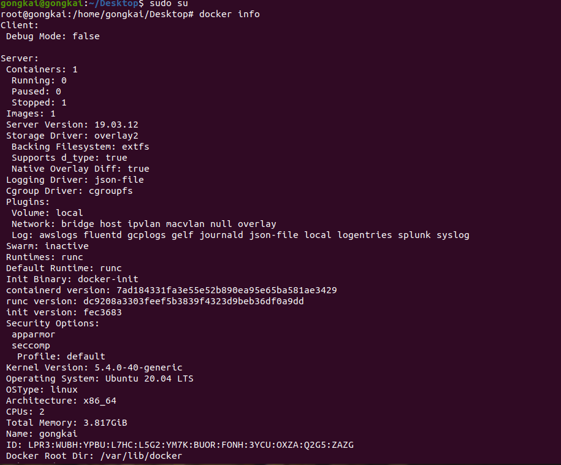
******
# 2、mongodb安装及实验
## mongodb的安装
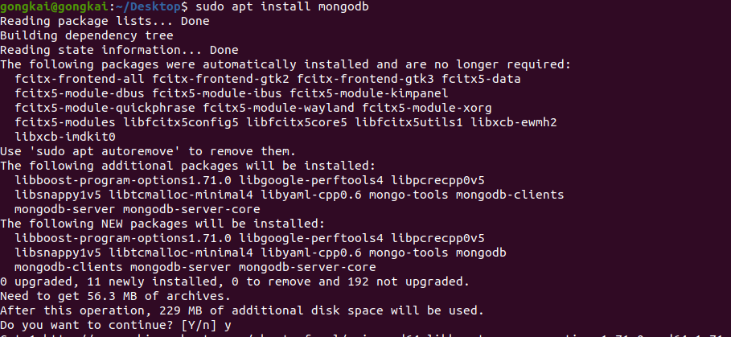
## 运行后台管理shell，进行算术运算及插入数据并检索
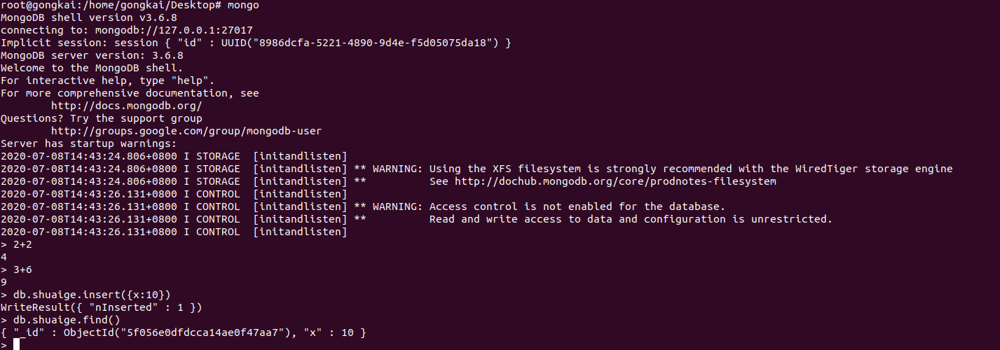
## 安装 mongodb compass并连接到集群
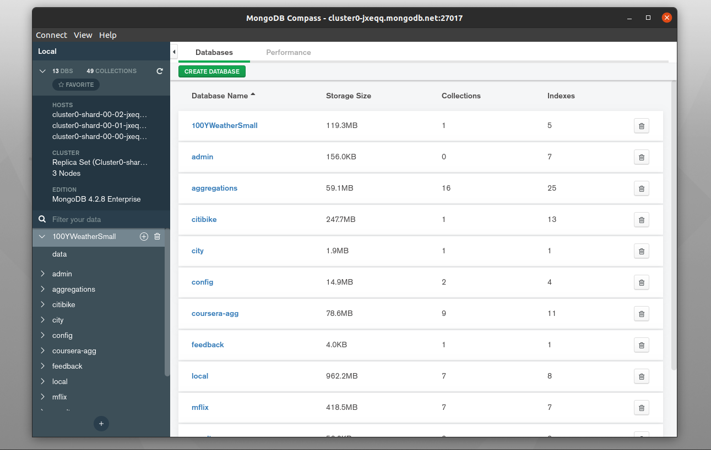
## 使用shell连接到集群并查看数据库
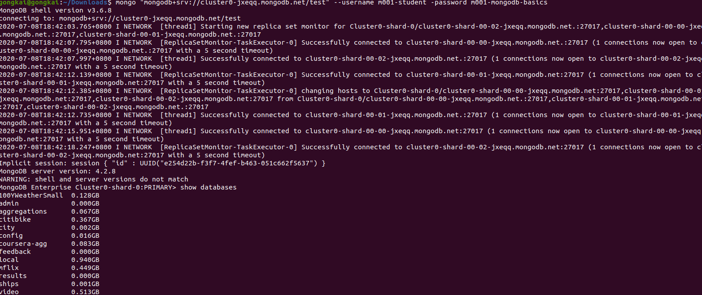
### （作业lab1.2-lab1.4使用compass简单查看数据类型）
## lab1.5 
**problem:** How many movies in the video collection were directed by Patty Jenkins. Stated more precisely, how many documents in the video.movies collection have a value of "Patty Jenkins" for the director field?

**solution:** {"director":"Patty Jenkins"}

**answer:** 6
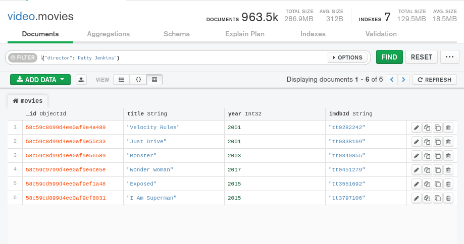
## lab1.6 
**problem:** How many documents in the citibike.trips collection have a tripduration that is greater than or equal to 60 and less than 65?

**solution:** {"tripduration":{"\$gte":60,"\$lt":65}}

**answer:** 745
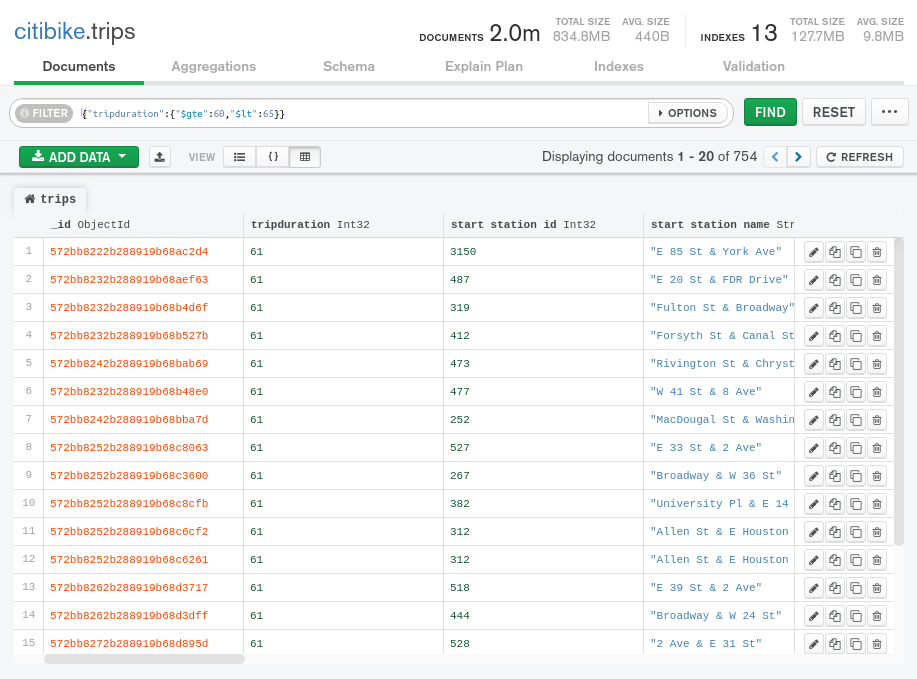
*****
# 3、mysql安装及实验
## 拉取mysql镜像
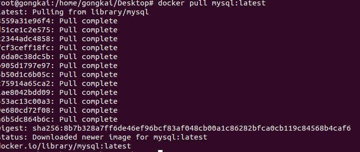
## 运行mysql容器
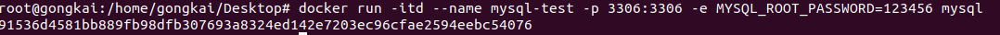
## 进入容器并运行mysql shell
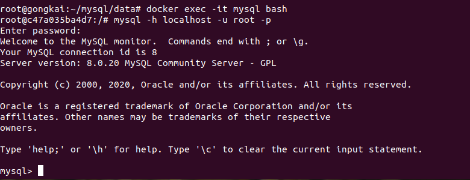
## 建立student表
字段包含id,name,age
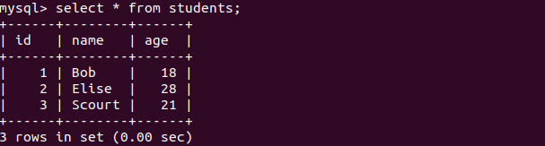
## 建立student_info表
字段包含id,phone_number
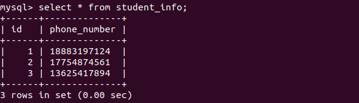
## 查询一个学生对应的student_info信息
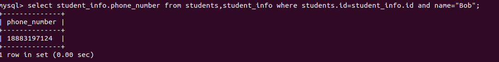
***
# 4、redis安装及实验
## 安装并测试redis
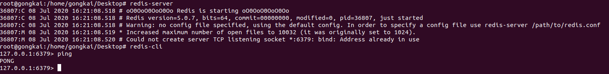
## string类型的基本操作
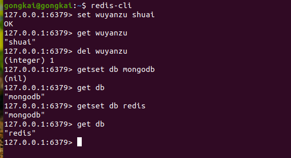
## hash类型的基本操作
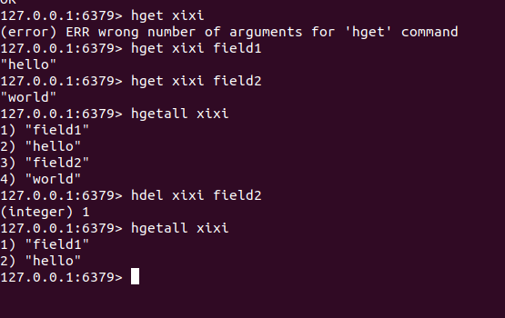
## list类型的基本操作
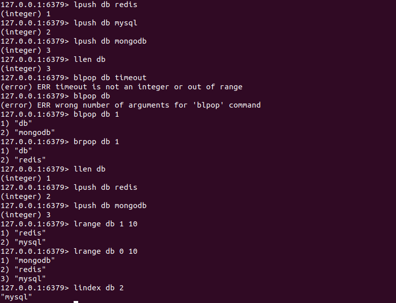
## set类型的基本操作
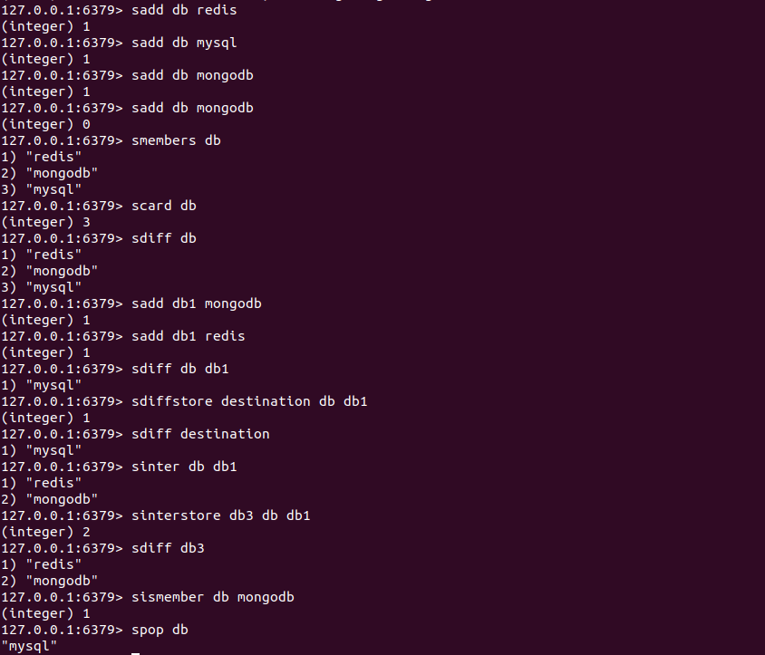
## zset类型的基本操作
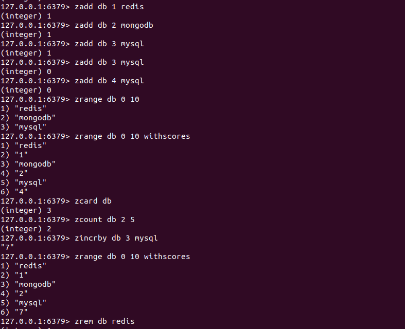
****
# 5、Janusgraph 实验
## janusgraph在docker中给的官方镜像不完整，故采用本地安装，直接下载zip的安装包，进入安装包即可使用
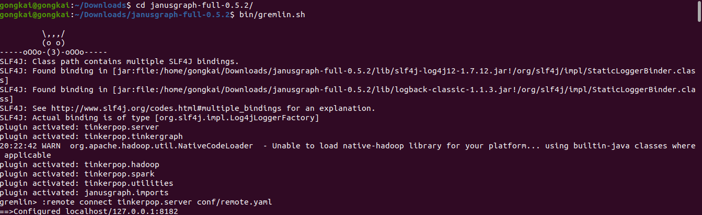
## 调用配置文件
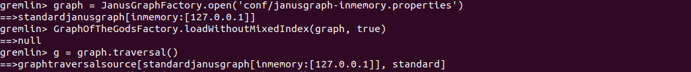
## 查询saturn节点作为谁的父亲的父亲，并获取其name属性

## 查询hercules父母亲节点的label及name属性

## 在图形索引中索引边缘,50公里内发生的所有事件 （纬度：37.97和长：23.72）
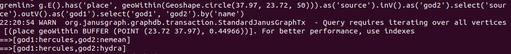
## 查询上述这些事件涉及哪些顶点
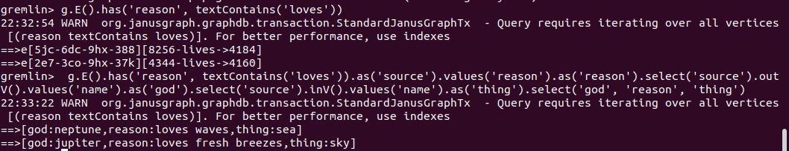
## 查询saturn父亲节点的兄弟的兄弟，输出其name属性
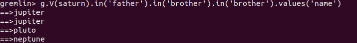
***
# 6、遇到的问题
问题主要集中在janusgraph,在docker安装和本地安装都遇到了无法打开配置文件的问题，无法运行 
`graph = JanusGraphFactory.open('conf/janusgraph-cql.properties')`
将其换成
`graph = JanusGraphFactory.open('conf/janusgraph-inmemory.properties')`
***
# 7、TODO：
深入学习mongodb和janusgraph的原理和使用