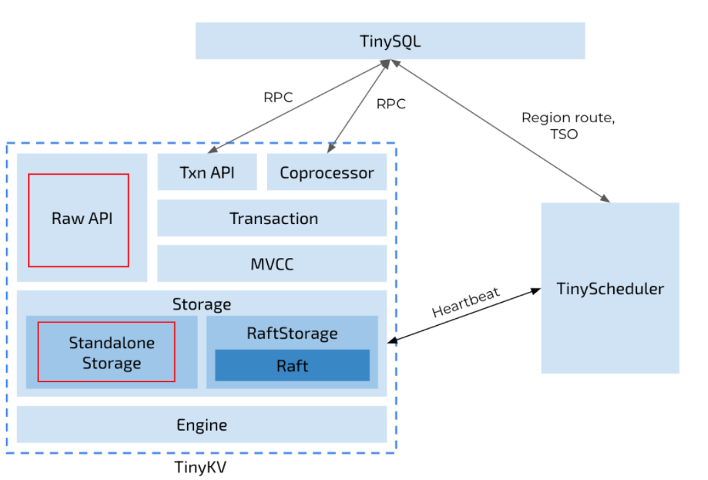
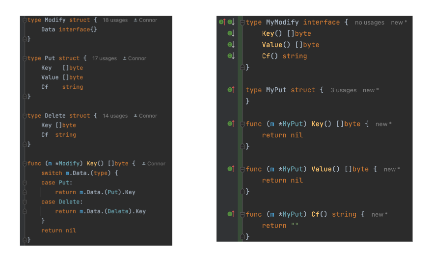
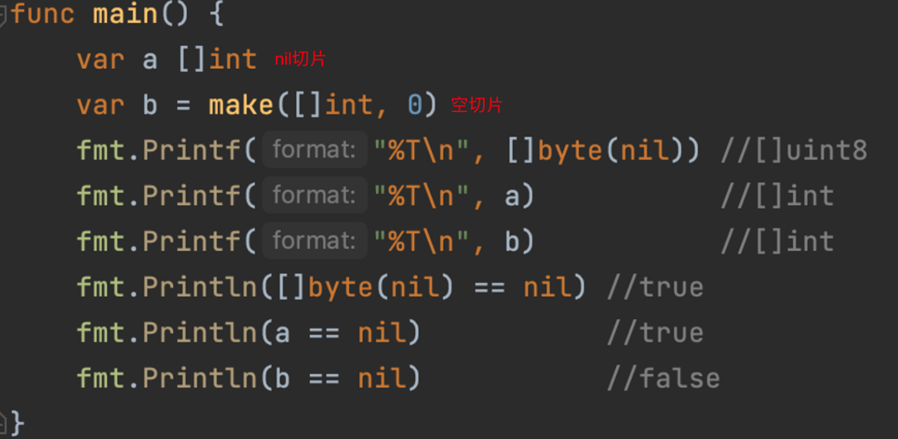
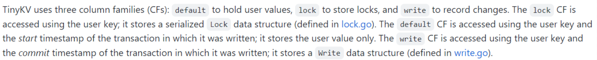

## 项目简介

下图展示了包含TinyKV的集群架构。该架构主要包含三个部分：TinySQL、TinyKV和TinyScheduler

此架构基于TiDB实现，上述三部分分别对应：TiDB、TiKV和PD

此架构的主要特点是：存储与计算的分离

下图中红色方块部分对应Project1的主要工作

## 项目问题

### error的处理

go语言函数通常使用error类型作为函数返回值，以表示函数是否正确执行结束。本项目同理，error信息通过：Engine、Storage、Server到Client，逐层向上传递。

但是RPC的Response结构体定义中，同时包含了RegionError和一般的error（string形式），对此师兄的解释是：在TiDB中，通常以RegionError表示再次执行可以避免的错误。

因此我们可以认为RegionError代表具有特殊意义的错误，Error则是更为普遍的错误，所以在Response结构体中含有两个所谓的“error”

本项目的本地测试没有对error做测试，所有的场景error都应为空，所以上述讨论知识一个假定结果。

### Go语法问题

#### Modify的实现

下图中，左侧代码是TinyKV的实现方式；右侧代码是詹越扬同学提出的继承方式。

讨论结果：

- 左侧：
  - 代码更符合Go语言的一般编程习惯，用空接口代表任意类型的数据，然后通过类型转换/类型断言，恢复具体的数据类型
  - 但是关联性不明显，对于初学者较难观察出Put、Get与Modify之间的关系
- 右侧：
  - 将Modify实现为接口，对象继承关系明显
  - 代码量更多，稍显冗余

#### 特殊切片的区分

陈雪同学给出了nil切片、空切片和零切片的区分代码

- nil切片：在声明时未做初始化的切片，不用分配内存空间，一般使用var创建
- 空切片：长度、容量为0的切片，一般使用make创建
- 零切片：初始值为类型零值的切片

### CF

会中讨论了列族的优点以及TinyKV为什么要支持列族

#### 优点

这个概念从 HBase 中来，就是将多个列合并为一个CF进行管理。这样读取一行数据时，你可以按照 CF 加载列，不需要加载所有列（**通常同一个CF的列会保存在同一个文件中，所以这样有很高的效率**）。此外因为同一列的数据格式相同，你可以针对某种格式采用高效的**压缩算法**。CF的本质，就是key的前缀，就是一个字符串，起命名空间的作用。

#### TinyKV中的列族

主要体现在Project4中，这里提前介绍一点。

- default：用来保存用户值
- lock：    用来存储锁
- write：   用来记录变化
