# Project2 RaftKV

- [x] A. 实现基础的Raft算法	

  - 领导者选举

  - 日志复制

  - RowNode交互接口

- [x] B. 在Raft基础上构架一个容错的KV存储服务	

  实现了RowNode之上的上层应用	

  - peer_msg_handler.go ： 处理上下层message	

  - peer_storage.go ： 负责该peer的存储

- [ ] C. 实现集群的快照功能

## 结构梳理

这里将 Rawnode-Raft-RaftLog 统称为 raft 层，把要实现的部分称为 peer 层。peer 层首先接收来自 client 的 RaftCmdRequest，其中包含着不同的命令请求，接着它会把这些请求逐一以 entry 的形式传递给 raft 层，当然，这个 peer 应该是 Leader，不然 client 会找下一个 peer 继续试。raft 层收到条目后，会在集群内部进行同步，这就是 project2a 的内容。同步的过程中，peer 层会不时询问 raft 层有哪些已经同步好的 entry 可以拿来应用（执行）？哪些 entry 需要持久化？有没有快照需要应用？等等。如果有ready返回回来，那就根据其中的内容去做持久化，应用快照，执行apply到状态机等等。

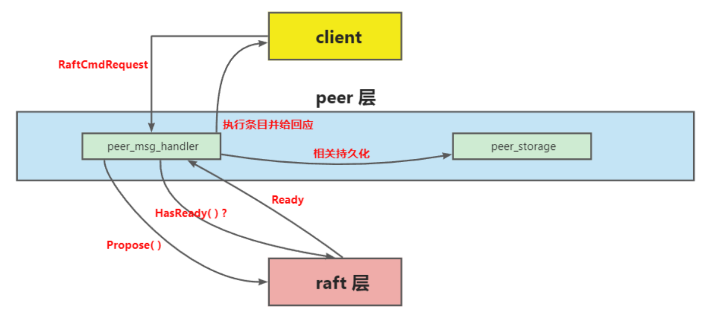

## 问题

### find no region

除测试外和启动第一个 peer 外,peers 应该从持久化的状态中读取, 而不是由上层传入.

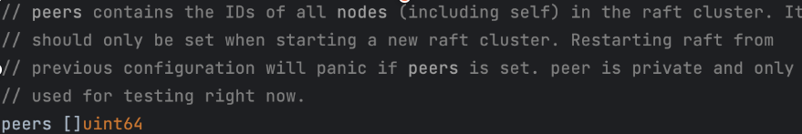

解决方案：raft.go newRaft()peers 优先使用 storage 中的 confState.Nodes 的值.

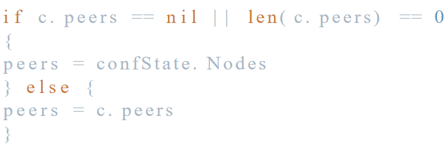

### runtime error

排查方法：日志搜索或许可以借鉴 etcd 打日志的方式

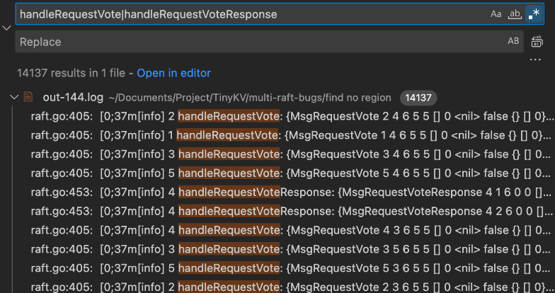

解决方案：修改 raft.go sendAppend() 中处理 index 的逻辑.

### cant call command header on leader n

WaitRespWithTimeout 超时了.router.peerSender 管道满了不停地向 router.peerSender 中发送消息, 导致管道堵塞, 引发卡死.

解决方案：Ready() 函数中应该将 raft 层提交给上层的 msg 清空.

### peer_Storage中的append

需要删除任何以前附加的永远不会提交的日志条目，也就是将append进去的entries的lastIndex到原本在storage中的lastIndex之间的日志条目全部删除。

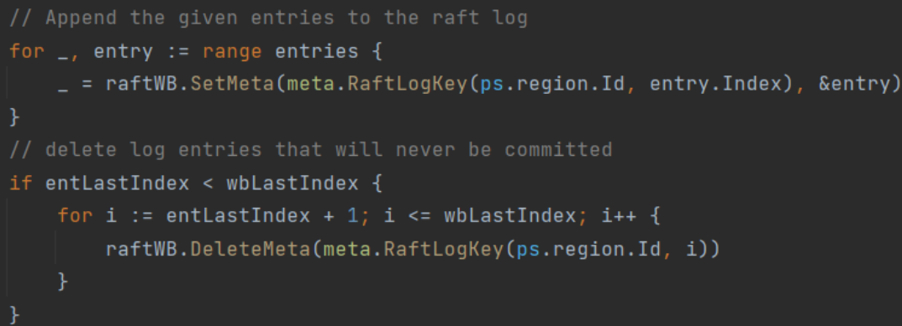删除append进去的entries的firstIndex到原本在storage中的lastIndex之间的日志条目，因为这些已经过时了，它们没有被commit，并且来自上一任Leader，所以他们永远没有机会被提交。然后，前面的entries的firstIndex到lastIndex之间的条目已经将原本这些Index的条目覆盖了

### proposal的回复处理

- 情况1：领导者变更，导致proposal在旧的领导者节点上，因此所有节点在应用日志后，都应该尝试在本节点上寻找proposal

- 情况2：领导者变更，导致propose的日志没有被提交

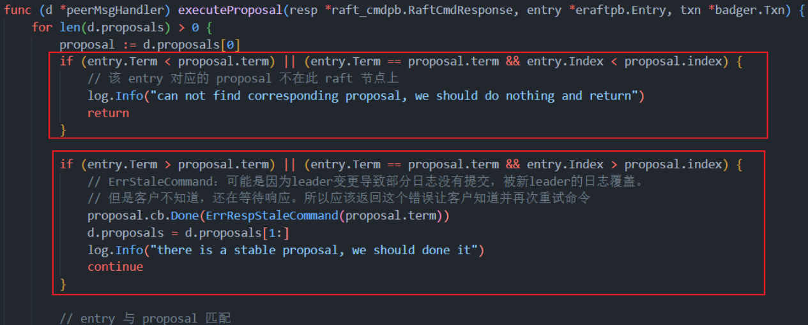

### leader节点

当put数据时，写入数据的必须是leader节点，测试用例中的处理方法：使用LeaderOfRegion找到leader，然后直接发送到leader上去。

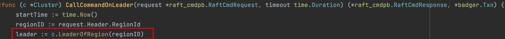

### 2AB 中关于storage 和 raftlog 中的位置关系

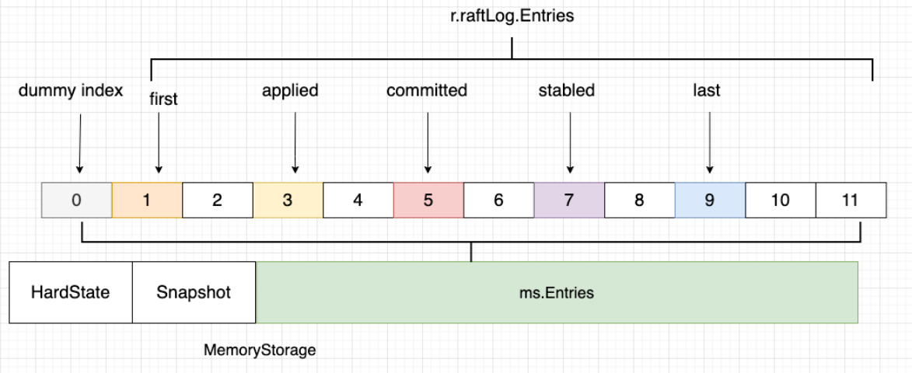

如果有使用 ApplySnapshot 的话那么 ms.ents 的第一位就是 snapshot 的 index，那么第一个index就应该在此基础上加一，如果没有使用 ApplySnapshot，那么在初始化的时候就放入了一个dummy entry，默认的index为 0，+1 后为 1 刚好是 index 的起始数字。

### RaftStore启动流程

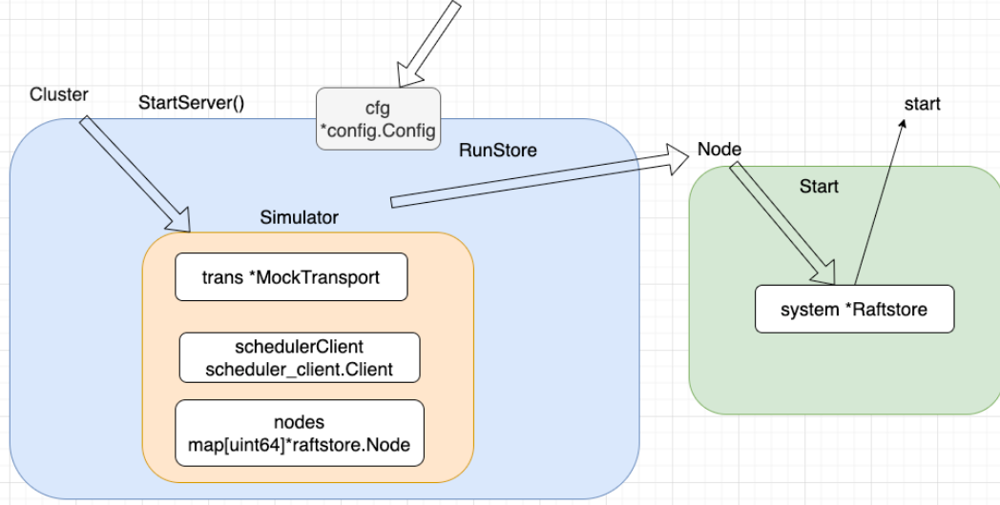

### HandleRaftReady中的顺序

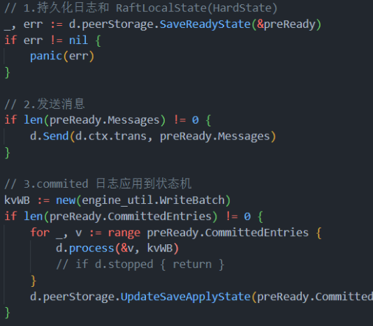

1必须放在第一位，2、3的位置没有要求。设计到崩溃日志重启的问题。

## 待解决

### request timeout

服务器和个人电脑测试时间相差较大

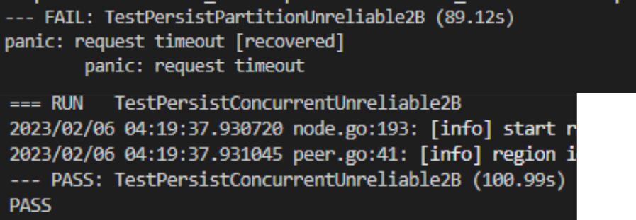

### Scan结果不符

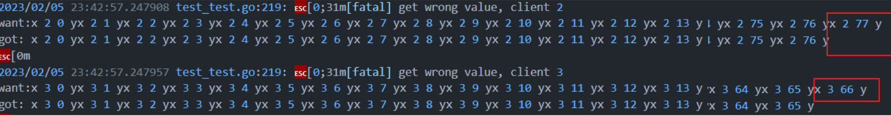

概率触发

