# Project2 RaftKV

- [x] A. 实现基础的Raft算法	

  - 领导者选举

  - 日志复制

  - RowNode交互接口

- [x] B. 在Raft基础上构架一个容错的KV存储服务	

  实现了RowNode之上的上层应用	

  - peer_msg_handler.go ： 处理上下层message	

  - peer_storage.go ： 负责该peer的存储

- [x] **C.** **实现集群的快照功能**

  - 日志压缩
  - 快照应用

## 基本流程

### 日志压缩

当日志的应用数量达到一定限制，onRaftGcLogTick函数发送一个Raft admin请求（CompactLogRequest），该 AdminRequest 封装成 entry 交给 raft 层来同步；当该 entry 需要被 apply 时，HandleRaftReady( ) 开始执行该条目中的命令 。这时会首先修改相关的状态，然后调用 d.ScheduleCompactLog( ) 发送 raftLogGCTask 任务给 raftlog_gc.go。raftlog_gc.go 收到后，会删除 raftDB 中对应 index 以及之前的所有已持久化的 entries，以实现压缩日志。

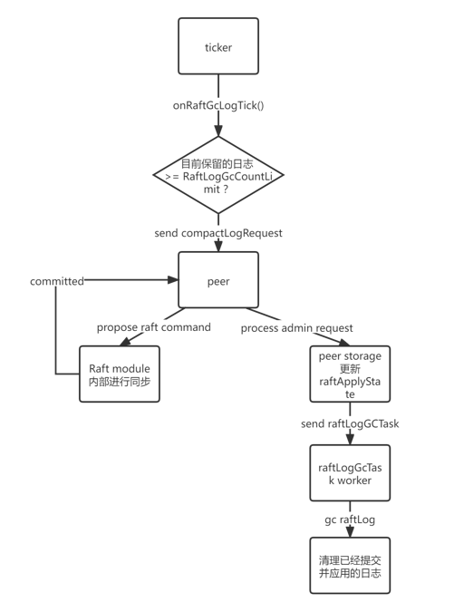

### 快照应用

当 Leader 发现要发给 Follower 的 entry 已经被压缩时，Leader就会产生一个快照信息（通过发送 RegionTaskGen 到 region_task.go 中处理，会异步地生成 Snapshot。）发送到这部分结点。然后SaveReadyState就可以应用这个快照信息（需要生成一个 RegionTaskApply，传递给 ps.regionSched 管道即可。region_task.go 会接收该任务，然后异步的将 Snapshot 应用到 kvDB 中去。），这样就可以做到让落后太多的结点快速更新到较新的状态，这样就完成了快照应用。

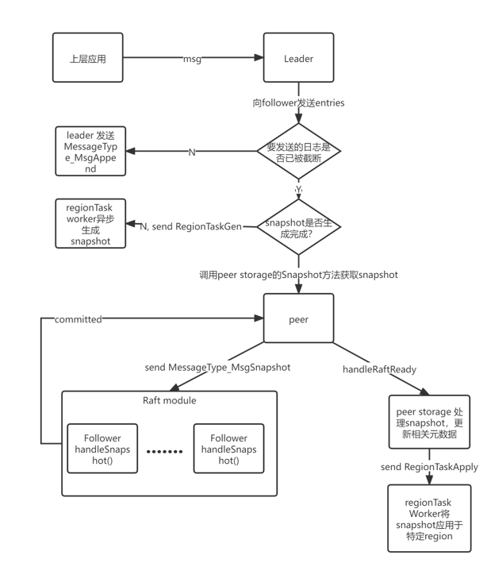

## 项目问题

### 流程相关

#### Q:何时生成了 snapshot?

误解：在日志压缩完成后会产生snapshot。

实际：调用 ScheduleCompactLog 生成一个gc Task，而进行的处理只是截断。

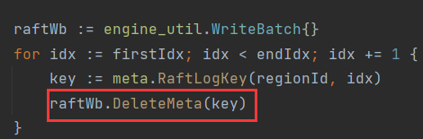

A: 产生snapshot的时机：

若Raft中有一部分结点之前被隔离或者新启动的一个结点，导致其当前存储的日志太老了，老到已经被压缩删除了，此时 Leader 需要发送 Snapshot 给落后的节点进行日志同步。

> 其他raft实现中，何时生成快照：
>
> 常见的策略是当日志记录个数达到一个固定阀值的时候（比如etcd是10000条），就触发一次创建快照的操作，生成相应的快照文件，我们可以通过调节该阀值来控制创建快照的频率。

#### Q：在生成快照之后，是如何发送快照的？

A: 与快照相关的几个结构体：

- SnapManager：专门处理数据快照的生成与转存

- SnapWorker：负责接收和发送任务

- SnapRunner：SnapWorker的处理函数（执行具体的任务）

1. 首先在kv/storage/raft_storage/transport.go的SendSnapshotSock()里将 RaftMessage 包装成一个 sendSnapTask 任务（只包含 Snapshot 的元信息），然后将其交给独立的 snapWorker 去处理；

2. snapWorker 接收到任务之后，转交给 snapRunner 处理，在snapRunner的handle()中，如果接收的是sendSnapTask任务，会调用sendSnap()发送真正的快照数据，然后通过给callback发送错误信息：    

   sendSnap(): 首先通过接收到的 Snapshot 元信息从 SnapManager 取到待发送的快照数据，然后创建全新的 gRPC 连接，通过 client streaming 调用的方式将完整的快照数据划分为一个一个的 SnapChunk 分批发送出去。

   > 补充：在tinykv中发送的快照数据是一个一个kv值，但是在tikv中是SST注入。

#### Q：raft.RaftLog.pendingSnapshot 在 Ready() 中清除还是 Advance () 中清除？

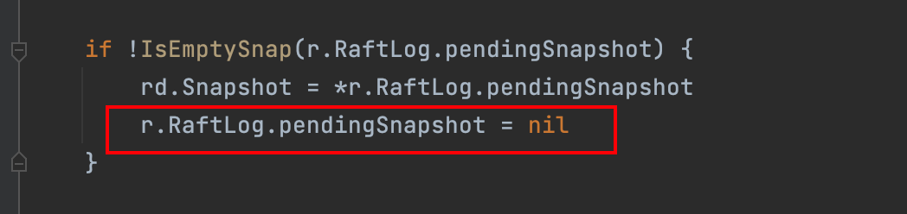

A: 在 Ready() 中清除还是 Advance () 中清除都可以通过测试；但在 Ready() 中清除跟符合代码逻辑。

#### Q: Snapshot() 快照的异步生成，怎么实现的异步？通道还是协程？

A：通过通道进行消息同步，与此同时携程在等待消息，在接收并处理消息后再返回一个消息实现异步。

### 测试相关

#### Q: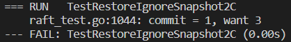

 A: follower在接收快照时，需要判断一下该快照是否是一个过期的快照，即自身日志的committedIndex是否大于快照的Index，如果大于则要拒绝此次快照

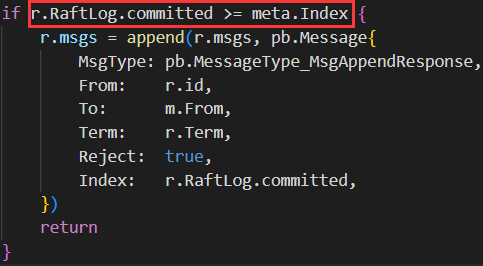

#### Q: 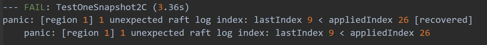

A: 原因排查在Raft的handleSnapshot函数中，更新日志数据后，需要把r.Raftlog.entries清空

#### Q: Runtime Error: out of range [0]

A: log.go 文件中的Index的maybeCompact函数，截断日志时需要处理好边界条件

#### Q:(3%)Bug 出现时, 最后一个 Entry 的 Index 和访问越界的 Index 的差值绝大多数时候为 5.（2b中的偶现问题)

**排查方法:**在日志中从 panic 的位置向前分析, 发现这个 Bug 出现前通常伴有 Partition 现象.同时, leader progress 中存储的 next 比自身的 lastIndex 大了很多.沿着 next 修改的位置加日志后发现 append entries 返回的 index 值大于 leader.lastIndex. 由于 leader 使用了这个 index 值来更新 next, 导致了数组越界的情况.

**错误原因:**becomeFollower 时将 Vote 设置为了 None, partition 后有可能选出两个 Leader.

同时解决问题：

（1%)

（1%)

#### Q: 

**排查方法：**在日志中从 panic 的位置向前分析, 发现这个 Bug 出现前通常伴有 节点重启 现象.添加日志 输出 entry 的 lo, hi, 以及 entries 后, 发现 storage 中仅存储了 lo 所在的那一个 entry, 没有 lo 到 hi 之间的 entries.也就是说 lo 和 hi 已经被修改, 而中间的日志产生了 “缺失”, 很有可能是 snapshot 覆盖了日志.

**解决方案：**修改 SaveRaftReady() 中应用 snapshot 和 append  entries 的顺序.先处理snapshot 。

#### Q:问题描述：日志没有成功压缩

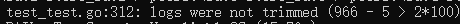

test_test.go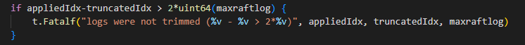

A: peer将CompactLogRequest请求propose到Raft层后，还需要在HandleRaftReady()中等待Raft层同步返回的ready并执行该Compact请求。此时可以修改RaftApplyState中的RaftTruncatedState属性，测试函数就是根据该属性判断日志是否成功截断。

### 代码中值得借鉴的部分

#### 1. 将handler作为一个接口

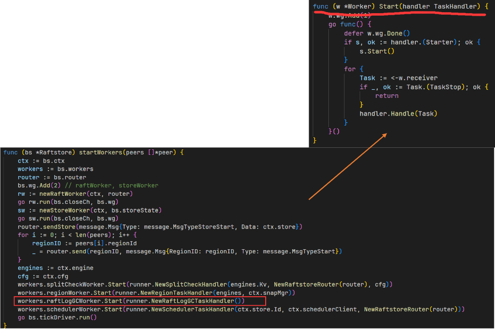

woker的start函数传入一个handler，这是一个非常好的抽象，把所有的handler作为一个接口，然后每一个结构体去实现对应的handle函数。

#### 2. 多worker协作

每一个场景都有一个worker通过管道发送一个封装好的task，然后由另一个worker来接受并处理task，如果处理结果需要返回，则通过另一个管道返回处理结果。

比如在这个部分的实验中：

- 通常raft-worker为Task发送方

- Task的处理由其他worker完成

- 需要返回结果时，通常由发送方将管道包装在Task内发送（快照的生成与应用）

### 仍未解决

#### Q: GC是一个异步场景，但是没有返回结果，可能导致无法获知该段日志是否删除成功

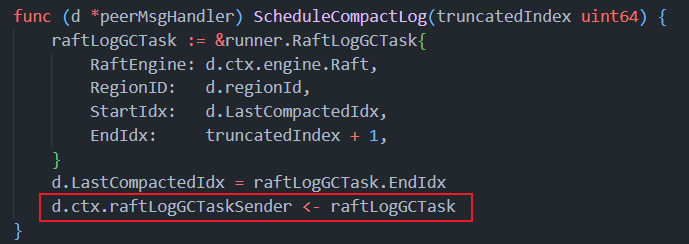

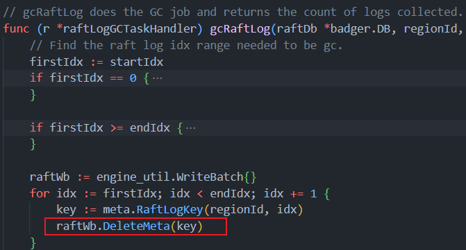

#### Q：缺少对持久化日志成功删除的test

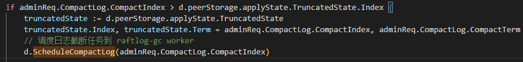

即使没有调用ScheduleCompactLog函数也可以通过测试。

目前的测试只对truncatedState进行检查，并没有对日志实际是否被删除进行检查。