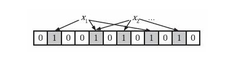
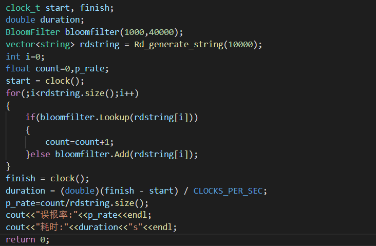
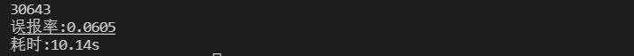
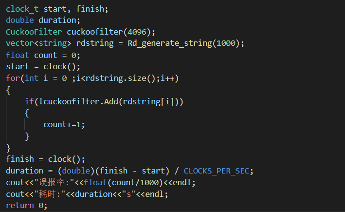
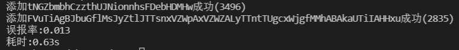

## Bloom Filter

### 一、简介

Bloom Filter(BF)是一种数据结构，目的是为了在快速且节省内存的情况下告诉您某个元素是否在集合中。BF求得的结果并不肯定：它只会告诉你元素**肯定不在集合中**或者**可能在集合中**。

基本思路如下：



首先实现一个位数组用来存放输入。

存入：将输入 xi 经过 k 个不同的哈希函数映射到 k 个位置，将这 k 个位置置为1（如果在存入前已经是1了则不需要修改）。

查询：输入一个 xi 经过 k 个不同的哈希函数，映射得到 k 个位置，如果这 k 个位置不全是1，则该xi不在集合中；反之若该k个位置全为1，则该 xi 可能在集合中（因为这 k 个位置被置为1可能不是由该 xi 引起，而是由其他输入引起）。

### 二、实现

```
BloomFilter.h
- Add(string str); //添加数据到集合中
- Lookup(string str); //查询数据是否在集合中

Hash.h
- vector<uint32_t> Murmurhash(string str); //输入str 返回一个uint32_t值的vector
- Murmur3_32(std::vector<uint8_t>& input,uint32_t seed);  //网上找的murmurhash3实现 
- rotl32(uint32_t x, int8_t r);
```

测试：

测试代码：



随机生成了1000个str，使用了4000大小的位数组进行实验，误报率0.054（继续扩大位数组容量误报率会下降）,耗时0.94s；


随机生成10000个str，使用大小40000的位数组进行实验，误报率为0.0605，耗时10.14s;



与测试用例2相同生成10000个str，使用大小40000的位数组进行实验，将哈希函数个数设置为3，误报率为0.0494，但用时增加为12.906s；


分析：根据公式k = (m/n)*ln2 来选取哈希函数个数可以得到更优的结果。

### 三、遇到的问题&TODO

1、因为BF是用位数组来进行0/1的存储达到节省空间的目的，想用其他类型的数据实现位数组有点麻烦。（最后用bitset实现）

2、Bloom Filter增添一个计数器可以支持删除操作。

## Cuckoo Filter

### 一、简介

Cuckoo Filter本身的思想来自于布谷散列，一个布谷散列通常有两张表，分别对应一个Hash函数。

基本思路如下：

当有新的项插入时，它会计算出这个项在两张表中对应的位置。如果这两个位置存在空位则插入空位，反之则随机踢走两个位置中的一个元素 x ，然后把该元素放置到它的另一个Hash位置 idx 去。如果该位置也被占了，则再踢走 idx 上的元素放入 x，依次反复。

### 二、实现

实现的是一个bucket的Cuckoo Filter ，可以优化的思路是增加bucket的数量（？），和一个位置存放多个指纹。

```
CuckooFilter.h
- int Add(string str);    //添加数据到集合中
- int Lookup(string str);  //查询数据是否在集合中	
- int Delete(string str);  //删除某一个数据
- int Add_Conflict(uint32_t idx , uint8_t fingerprint); //处理冲突

Hash.h
- vector<uint32_t> Murmurhash(string str); //输入str 返回一个uint32_t值的vector
- Murmur3_32(std::vector<uint8_t>& input,uint32_t seed);  //网上找的murmurhash3实现 
- rotl32(uint32_t x, int8_t r);
```

测试:

测试代码：



随机生成1000个str,使用桶大小4096进行测试，误报率0.013,耗时0.63s.



### 三、遇到的问题&TODO

1、在输入 str 后得到 hash1 ，取余得到 idx1 ，然后保存 hash1 的后几位作为fingerprint。需要用 fingerprint 和 idx1得到idx2 ，在对 hash2 = hash(fingerprint)^idx1 取余时没想明白为什么这样做是对的。（后来搞懂了是bucket的大小只能是2的指数倍，才能保证取余操作是直接对二进制做截断 ， 其余的大小会改变hash后的结果。）

2、两个桶之间可以通过 idx1^p^p=idx1 来实现互相知道对方的位置，增加了多个桶的话怎么实现互相能计算位置（？）

