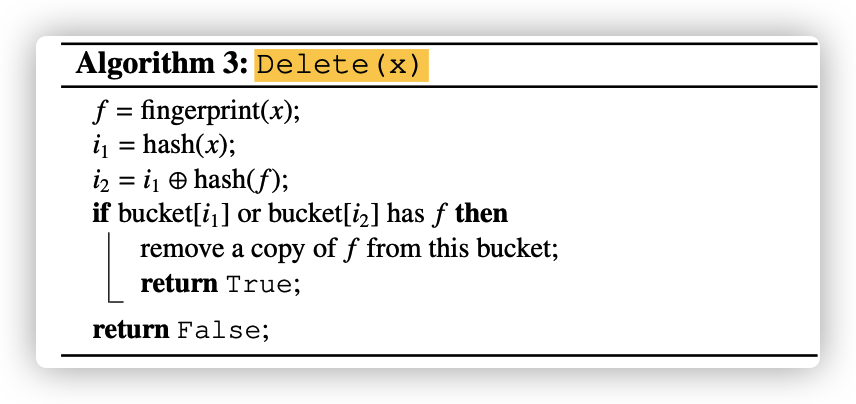

# Week 2 Data Structure I

---

## *Bloom Filter | 布隆过滤器* 

> 布隆过滤器（英语：Bloom Filter）是1970年由布隆提出的。
>
> 它实际上是一个很长的**二进制向量**和**一系列随机映射函数（哈希函数）**。布隆过滤器可以用于**检索一个元素是否在一个集合**中。
>
> 它的优点是**空间效率**和**查询时间**都远远超过一般的算法，缺点是有一定的**误识别率**和**删除**困难。

### 主要参数

| 参数名      | 类型            | 介绍                     |
| ----------- | --------------- | ------------------------ |
| `bitmap`    | `[]byte`        | 用于存储1或0的位图       |
| `n`         | `uint`          | 集合中当前元素个数       |
| `m`         | `uint`          | 位图的长度               |
| `k`         | `uint`          | 哈希函数的个数           |
| `hashFuncs` | `[]hash.Hash64` | 哈希函数数组             |
| `mutex`     | `*sync.RWMutex` | 读写锁，用于保证线程安全 |

### 实现

#### 初始化

如果调用 `New` 函数未传入用户自定义的参数，则默认使用3个哈希函数（`fnv`, `murmur3`），位图长度为 $2^{18}$。

```go
// Default configuration
func configuration(bf *BloomFilter) {
	if bf.hashFuncs == nil {
		bf.hashFuncs = []hash.Hash64{
			fnv.New64(),
			fnv.New64a(),
			murmur3.New64(),
		}
		bf.k = uint(len(bf.hashFuncs))
	}
	if bf.m == 0 {
		bf.m = 1 << 18
	}
	bf.n = uint(0)
	bf.bitmap = make([]byte, bf.m / 8 + 1)
	bf.mutex = &sync.RWMutex{}
}

// New - Return a new bloom filter
func New(opts ...func(*BloomFilter)) *BloomFilter {
	bf := new(BloomFilter)
	// set the custom config
	for _, opt := range opts {
		opt(bf)
	}
	// set the default config
	configuration(bf)

	return bf
}
```

#### 哈希

根据参数中的哈希函数计算传入字符串的哈希值，返回一个哈希值数组。

```go
// Generate the hash value of item over three hash functions
func (bf *BloomFilter) hashValues(item []byte) []uint64 {
	var result []uint64
	for _, hashFunc := range bf.hashFuncs {
		_, err := hashFunc.Write(item)
		if err != nil {
			fmt.Println(err)
		}
		result = append(result, hashFunc.Sum64())
		hashFunc.Reset()
	}
	return result
}
```

#### 插入

`Set`方法：将元素插入到布隆过滤器中。

先计算传入字符串的哈希值数组，按照哈希值数组将底层的位图的对应 `bit` 位置为 `1`。

```go
// Set - Adds the item into the bitmap of bloom filter
func (bf *BloomFilter) Set(item []byte) {
	bf.mutex.Lock()
	defer bf.mutex.Unlock()
	// get hash values according to the number of hash functions
	hashes := bf.hashValues(item)
	for i := uint(0); i < bf.k; i++ {
		position := uint(hashes[i]) % bf.m
		byteIndex := position / 8
		if byteIndex >= uint(len(bf.bitmap)) {
			return
		}
		bitIndex := position % 8
		bf.bitmap[byteIndex] |= 1 << bitIndex
	}
	bf.n++
}
```

`Set`方法的单元测试：

```go
func TestSet(t *testing.T) {
	bf := New()
	bf.Set([]byte("thomison"))
	assertEqual(t, bf.Count(), uint(1), "Expected current size of elements to be 1.")
	bf.Set([]byte("tangyiheng"))
  assertEqual(t, bf.Count(), uint(2), "Expected current size of elements to be 1.")
}
```

```bash
(base) ➜  bloom-filter go test -v -run TestSet               
=== RUN   TestSet
--- PASS: TestSet (0.00s)
PASS
ok      data-structure/bloom-filter     0.245s
```

`Set`方法的并发测试：

```go
threads = 100			// number of goroutine

func TestConcurrentSet(t *testing.T) {
	bf := New()
	var wg sync.WaitGroup
	wg.Add(threads)
	
  for i := 0; i < threads; i++ {
		go func() {
			defer wg.Done()
			bf.Set([]byte("tangyiheng"))
		}()
	}
  
	wg.Wait()
	assertEqual(t, bf.Count(), uint(threads), "Expected current size of elements to be 100")
}
```

```bash
(base) ➜  bloom-filter go test -v -run TestConcurrentSet      
=== RUN   TestConcurrentSet
--- PASS: TestConcurrentSet (0.00s)
PASS
ok      data-structure/bloom-filter     0.252s
```

`Set`方法的性能测试：

```go
func BenchmarkGet(b *testing.B) {
	bf := New()
	buf := make([]byte, 4)
	for i := 0; i < b.N; i++ {
		intToByte(buf, i)
		bf.Get(buf)
	}
}
```

```bash
(base) ➜  bloom-filter go test -bench=BenchmarkSet -benchmem   
goos: darwin
goarch: arm64
pkg: data-structure/bloom-filter
BenchmarkSet-8          10085940               108.2 ns/op            56 B/op          3 allocs/op
PASS
ok      data-structure/bloom-filter     1.298s
```

#### 查询

`Get`方法：查询指定元素是否在布隆过滤器中。

先计算传入字符串的哈希值数组，按照哈希值数组查询底层的位图对应的每一个 `bit` 位是为`1`，只要有一个位是 `0`，则判断元素不在位图中。

```go
// Get - Check the item if it in the bitmap of bloom filter
func (bf *BloomFilter) Get(item []byte) bool {
	bf.mutex.RLock()
	defer bf.mutex.RUnlock()
	// get hash values according to the number of hash functions
	hashes := bf.hashValues(item)
	result := true
	for i := uint(0); i < bf.k; i++ {
		position := uint(hashes[i]) % bf.m
		byteIndex := position / 8
		if byteIndex >= uint(len(bf.bitmap)) {
			return false
		}
		bitIndex := position % 8
		if bf.bitmap[byteIndex] & (1<<bitIndex) == 0 {
			result = false
			break
		}
	}
	return result
}
```

`Get`的单元测试：

```go
func TestGet(t *testing.T) {
	bf := New()
	bf.Set([]byte("thomison"))
	bf.Set([]byte("tangyiheng"))

	res := bf.Get([]byte("thomison"))
	assertEqual(t, res, true, "Expected true.")
	res2 := bf.Get([]byte("uestc"))
	assertEqual(t, res2, false, "Expected false.")
}
```

```bash
(base) ➜  bloom-filter go test -v -run TestGet                 
=== RUN   TestGet
--- PASS: TestGet (0.00s)
PASS
ok      data-structure/bloom-filter     0.584s

```

`Get`的性能测试：

```go
func BenchmarkGet(b *testing.B) {
	bf := New()
	buf := make([]byte, 4)
	for i := 0; i < b.N; i++ {
		intToByte(buf, i)
		bf.Get(buf)
	}
}
```

```bash
(base) ➜  bloom-filter go test -bench=BenchmarkGet -benchmem
goos: darwin
goarch: arm64
pkg: data-structure/bloom-filter
BenchmarkGet-8          11619662               103.2 ns/op            56 B/op          3 allocs/op
PASS
ok      data-structure/bloom-filter     2.821s
```

### 优缺点

布隆过滤器的特点是允许小部分的假阳率，且具有非常好的空间效率。

但是，不允许从集合中删除条目，有尝试拓展布隆过滤器，但会降低空间效率或性能(插入或查找)

### 使用场景

​	利用布隆过滤器减少昂贵的磁盘IO或者网络请求。通过高效判断一个不存在的元素，以避免后续的昂贵的查询请求。

---

## *Cuckoo Filter | 布谷鸟过滤器*

布谷鸟过滤器的提出旨在改进布隆过滤器。


相比于布隆过滤器，布谷鸟过滤器的主要**优点**如下：

1. 支持动态添加和<u>删除</u>集合中的元素；
2. 提供比布隆过滤器<u>更高的查询性能</u>（即使在集合接近满员的状态下，因为其只需要一次哈希）；
3. 相比其他过滤器更容易实现（如counting Bloom、d-left counting Bloom等）；
4. 提供比布隆过滤器<u>更少的空间消耗</u>（更加紧凑）

布谷鸟过滤器和其他过w滤器之间的**比较**，就空间消耗、查询的缓存命中率、是否支持删除操作上：


1. 插入性能相比布隆过滤器要差（发生冲突需要执行 relocate 操作）

### 主要参数

| 参数名        | 类型            | 介绍                     |
| ------------- | --------------- | ------------------------ |
| `buckets`     | `[]bucket`      | 桶数组                   |
| `bucket`      | `[]fingerprint` | 定义桶为一个指纹数组     |
| `fingerprint` | `[]byte`        | 定义指纹为一个位向量     |
| `hashFn`      | `hash.Hash`     | 计算指纹的哈希函数       |
| `m`           | `uint`          | 桶的数量                 |
| `b`           | `uint`          | 桶的大小                 |
| `f`           | `uint`          | 指纹的大小               |
| `n`           | `uint`          | 集合中当前元素个数       |
| `maxNumKicks` | `uint`          | 发生冲突时最大“踢”的次数 |
| `mutex`       | `*sync.RWMutex` | 读写锁                   |

### 插入`Insert`

计算两个候选桶的索引：
$$
h_1(x)=hash(x)\\
h_2(x)=h_1(x)\oplus hash(fingerprint(x))
$$
如果我们要在桶 i 中踢走一个键，可以直接使用桶 i 的索引和其指纹来计算它的备用桶 j：
$$
j = i\oplus hash(fingerprint)
$$
插入算法：


```
计算x的指纹
计算x的主桶索引
通过x的指纹和主桶索引，计算x的备桶索引
如果两个桶中存在一个桶存在空余条目：
	则x的指纹放到该桶的对应条目中
如果两个桶都已满，则随机选择一个桶：
	在最大重置次数内，循环以下操作：
		随机从两个桶中的一个桶选出一个条目
		交换之前计算出的指纹和存储在该条目中的指纹
		计算被踢出元素的备桶索引
		如果该备桶中存在空余条目，则将其放入
		否则进入下一轮循环，迭代之前的操作
如果用完了最大重置次数，则判定哈希表已满，返回“失败”
```

### 查找 `Lookup`

查找算法：


```
计算x的指纹
计算x的主桶索引
通过x的指纹和主桶索引，计算x的备桶索引
	如果两个桶中存在对应指纹，则判断存在
	否则不存在
```

### 删除`Delete`

删除操作：

​	它检查给定项的两个候选桶；如果任何桶中的指纹匹配，则从该桶中删除匹配指纹的一份副本。



```
计算x的指纹
计算x的主桶索引
通过x的指纹和主桶索引，计算x的备桶索引
	如果两个桶中存在对应指纹，则从通中移除指纹的副本
```

### 实现思路

定义一个`bucket`类，用来表示一个桶，底层是一个指纹数组，每个指纹用于存储哈希值的部分位

需要支持以下操作：

- `insert`：向桶中插入一个指纹
- `delete`：从桶中删除一个指纹
- `lookup`：判断桶中是否存在某指纹

定义一个`filter`类，用来表示一个布谷鸟过滤器，底层是一个桶数组

需要支持以下操作：

- `Insert`：向过滤器中插入一个元素
- `Lookup`：判断一个元素是否在过滤器中
- `Delete`：从过滤器中删除一个元素
- `count`：查询集合中存储元素的个数

注意：桶数组的长度必须是 `2` 的指数，以保证当冲突时计算出来的下标一定落在桶数组内部

## *比较*

|                   | *Bloom Filter*               | *Cuckoo Filter*                          |
| ----------------- | ---------------------------- | ---------------------------------------- |
| 哈希算法          | 使用多个的哈希函数           | 使用布谷鸟哈希                           |
| 是否支持删除操作  | 不支持                       | 支持                                     |
| 空间是否为2的指数 | 否                           | 是                                       |
| 空间消耗          | 高                           | 同等误判下，节省40%                      |
| 查询性能          | 低（访问内存次数多）         | 高（访问内存次数少）                     |
| 插入性能          | 高                           | 低（冲突需要relocate）                   |
| 哈希相关性        | 哈希函数之间没有关系（独立） | 布谷鸟过滤器中的两个哈希函数可以互相推导 |
| 重复插入相同元素  | 自带重复过滤                 | 挤兑循环问题                             |

## *参考资料*

https://www.cnblogs.com/zhaodongge/p/15017574.html

https://www.cnblogs.com/zhaodongge/p/15067657.html

https://segmentfault.com/a/1190000039156246

https://stackoverflow.com/questions/867099/bloom-filter-or-cuckoo-hashing

http://www.linvon.cn/posts/%E5%B8%83%E8%B0%B7%E9%B8%9F%E8%BF%87%E6%BB%A4%E5%99%A8%E5%AE%9E%E6%88%98%E6%8C%87%E5%8D%97/

http://www.linvon.cn/posts/cuckoo/

CuckooFilter 的 Golang 实现：https://github.com/irfansharif/cfilter/；https://github.com/seiflotfy/cuckoofilter；https://github.com/panmari/cuckoofilter

CuckooFilter 论文：《**Cuckoo Filter: Practically Better Than Bloom**》

CuckooFilter 论文翻译：http://www.linvon.cn/posts/cuckoo/

