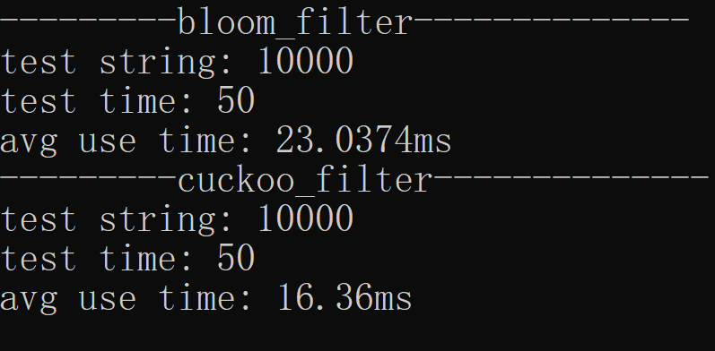
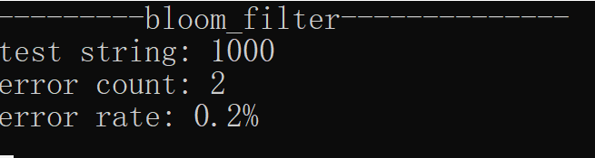

# 性能测试

2021.9.25 by Sunlly0

对bloom过滤器和cuckoo过滤器进行性能测试。

## 插入测试

生成10000条不同的随机字符串，存入文件randString_10000.txt中。

令bloom过滤器的bs_size为20000。

令cuckoo过滤器的bucket_num为256，bucket_size为80。

这样两者使用的空间数差不多。

调用insert(string key)方法，将10000条字符串分别插入两个过滤器，使用Timer进行计时。

测试50次，求平均的用时结果如下：

由图可知，在插入上，cuckoo过滤器的性能要好一些。

## 误报率测试

对bloom过滤器进行误报率测试。

生成两个无交集，并包含1000条不同的随机字符串文件，分别为randString1_1000.txt和randString2_1000.txt。

令bloom过滤器的bs_size为20000。hash_size为8。

首先，调用insert(string key)方法，将randString1_1000.txt文件中的1000条字符串过滤器。

接下来，调用lookup(string key)方法，对randString2_1000.txt中的1000条字符串进行查找。

理论上，对于不存在的字符串应该得到“查找失败”的结果。如果查找成功，则被判定为误报。结果如下：

bloom过滤器的误报率为0.2%。

## 总结
本次性能测试只从插入时间和bloom过滤器的误报率做了简单测试。不太完善。

未来还可以测试过滤器参数对性能的影响。
