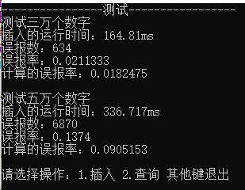
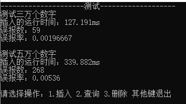

# 实验一 布隆过滤器
## 布隆过滤器的实现
* `hash.h`和`hash.cpp`：包含使用到的8个哈希函数BKDR，AP，RS，JS，SDBM，DJB，DEK，Murmur。  
参考[常见Hash算法](https://cloud.tencent.com/developer/article/1432686)以及[常用的Hash算法](https://www.cnblogs.com/rainy-shurun/p/5426570.html)，排除掉第一个博客中提到的效果最差的两个哈希函数PJW和ELF，从剩下的哈希函数中随意选出8个。
* `BloomFilter.h`和`BloomFilter.cpp`：布隆过滤器的实现函数，包括函数：
    * `gethash`：对于每个输入得到8个哈希函数的结果。
    * `add`：过滤器插入功能。主要使用bitset的set函数将得到的8个哈希函数的结果对应的bit位设置为1。
    * `isContain`：过滤器查询功能。主要使用bitset的test函数查看得到的8个哈希函数的结果对应的bit位是否为1。
## 布隆过滤器的测试
* `main.cpp`：布隆过滤器的测试函数。  
在这里，bit的大小设置为249997。  
首先完成0-29999数字的插入，再对30000-59999这30000个并未插入的数字进行查询，查看误报为查询成功的数字个数。 同时输出的还有插入的时间，误报率以及使用公式计算得到的误报率。
再测试五万个数据。
同时测试者可自行进行测试，进行插入、查询及删除操作。
## 布隆过滤器的结果  
  
从图中可以看到布隆过滤器的误报率要比使用公式计算出来的误报率高，说明哈希函数还有待改进。
## 遇到的问题
由于C++中bitset的初始化只能为确定的大小，所以没有使用公式计算bitset的大小以及Hash函数的个数。
## TO DO
后续可以尝试一下计数布隆过滤器的实现。

# 实验二 布谷鸟过滤器
## 布谷鸟过滤器的实现
* `CuckooFilter.h`和`CuckooFilter.cpp`：布谷鸟过滤器的实现函数，包括函数：
    * `FingerPrint`：得到指纹的哈希函数，使用的是BKDR哈希函数。
    * `MurmurHash`：得到数据对应位置的哈希函数，使用的是Murmur哈希函数。
    * `add`：过滤器插入功能。如果过滤器对应位置有空，则直接插入；如果没有，则踢出过滤器对应位置的随机一个数，插入指纹，同时为踢出的数重新找位置。以此类推。同时踢出的次数要有个阈值，如果一次插入操作达到这个阈值，说明该过滤器需要进行扩容了。
    * `isContain`：过滤器查询功能。查找过滤器对应位置是否有该数据。
    * `Delete`：过滤器删除功能。在过滤器对应位置找到该数并将插入的指纹清除，恢复为初始值。
## 布谷鸟过滤器的测试
* `main.cpp`：布隆过滤器的测试函数。  
在这里，过滤器使用的二维数组存放数据，第一维的大小为262144（用2的指数倍数且与249997大小最近，方便比较），第二维的大小为1，允许的最大踢出次数为10。当踢的次数达到阈值，则会输出需要扩容的提示。  
首先完成0-29999数字的插入，再对30000-59999这30000个并未插入的数字进行查询，查看误报为查询成功的数字个数。同时输出的还有插入的时间以及误报率。
再测试五万个数据。
同时测试者可自行进行测试，进行插入、查询及删除操作。
## 布谷鸟过滤器的结果  
  
布谷鸟过滤器在插入3万数字时并没有提示需要进行扩容，但在插入5万数字的时候提示需要进行扩容（因提示次数过多，所以图中将输出关闭了）。
和布隆过滤器的结果图对比，看出在布谷鸟过滤器未满的时候，插入时间是小于布隆过滤器的，但是在过滤器已满的情况下，插入时间甚至会大于布隆过滤器的。
## 遇到的问题
在插入时，数组可能产生溢出。
解决：桶的大小使用2的指数倍的数字。
## TO DO
如果要进行扩容，需要重置数组的大小，这时需要将数组换为容器vector。

# 对比
布谷鸟过滤器要比布隆过滤器要好。  
1.布谷鸟过滤器在没有溢出的情况下出现假阳性的概率要小，布谷鸟是因为可能出现相同的指纹，布隆是因为bit位相同；  
2.布谷鸟过滤器每个元素需要的存储空间更少，也就是说布谷鸟过滤器的空间性能要好，因为它只用了两个哈希函数来求存储位置；  
3.布谷鸟过滤器的查询性能也要好，因为哈希函数的个数要少；  
4.布谷鸟过滤器可以进行删除操作，但是对于基础的布隆过滤器来说并不支持删除操作。
