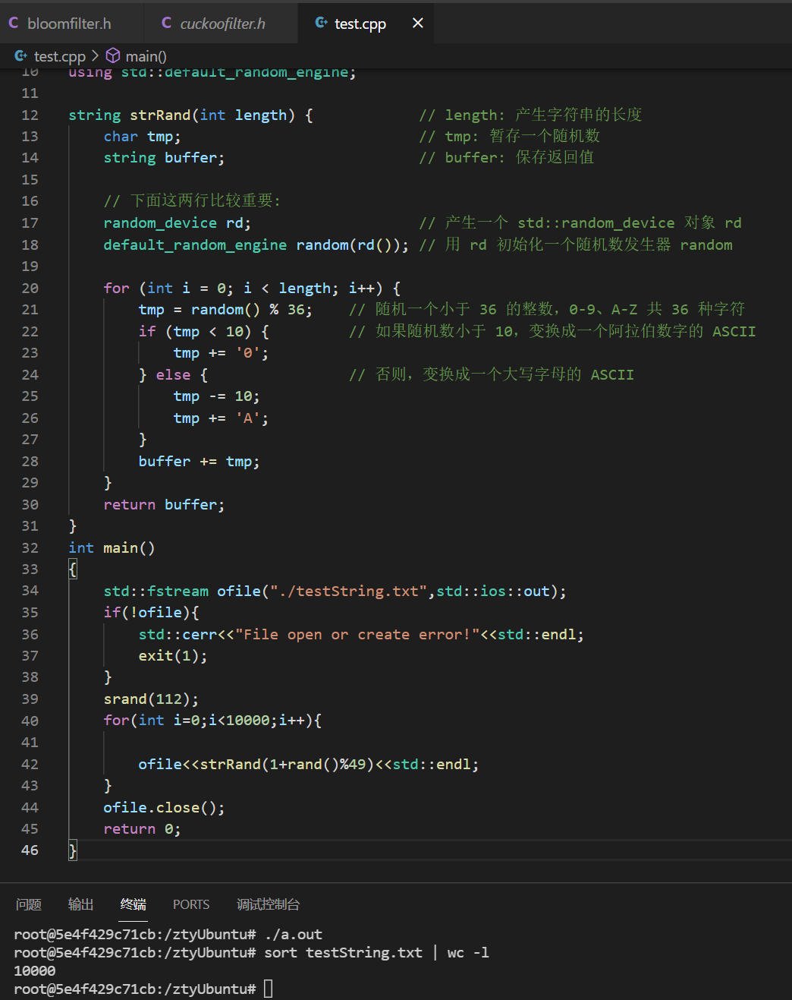
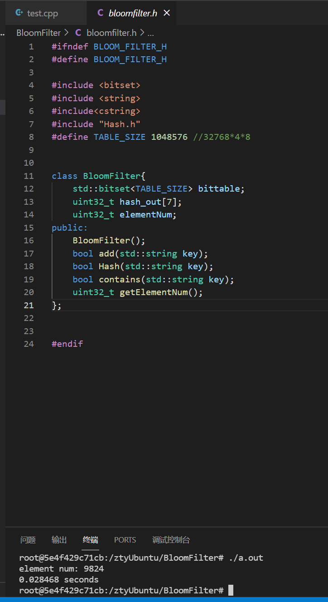
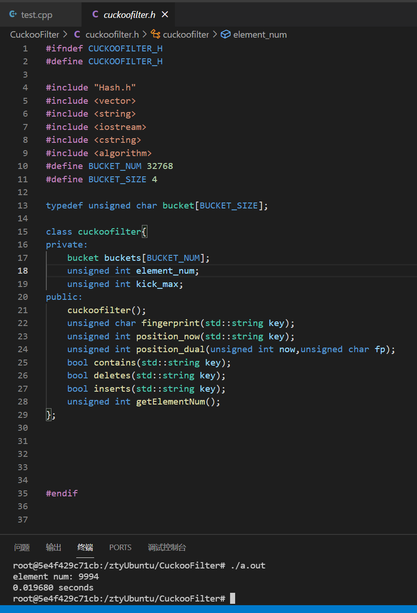

# 性能测试
## 一、随机生成10000条字符串

由命令`sort testString.txt | wc -l`可知，这些字符串不重复；

## 二、BloomFilter性能测试

由图可知，10000条字符串，布隆过滤器只添加了9824条，其中位表的占用空间和布谷鸟的桶的占用空间一样，为32768x4x8bit；用时平均0.03s。

## 三、CuckooFilter性能测试

由图可知，10000条字符串，布谷鸟过滤器添加了9994条，其中桶的占用空间为32768x4Byte；用时平均0.02s。

## 结论
由比较结果可知，布谷鸟过滤器在速度和空间利用率上都更好！