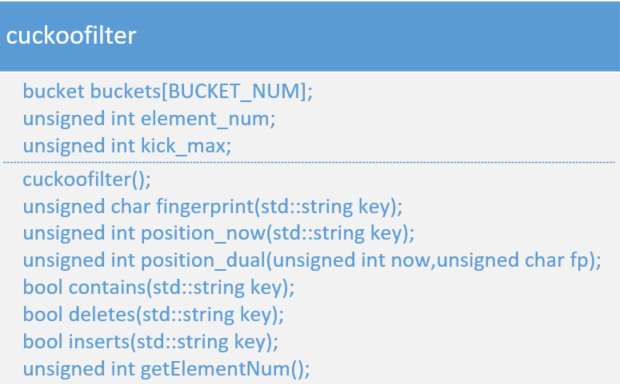

# BloomFilter

设计思路：
1. 使用哈希函数MurmurHash3_x86_32，设置7个不同的种子seed，得到7个哈希函数；
2. 位表大小为800000bit

# CuckooFilter

设计思路：
1. 设置指纹fingerprint大小为1个byte；
2. 桶的大小为4个fingerprint；
3. 桶的数量为32768；
4. 最大挤兑次数为1000；
5. 哈希函数使用MurmurHash3_x86_32

