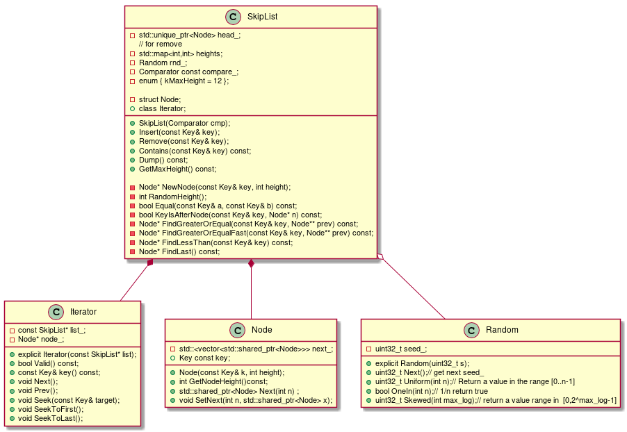
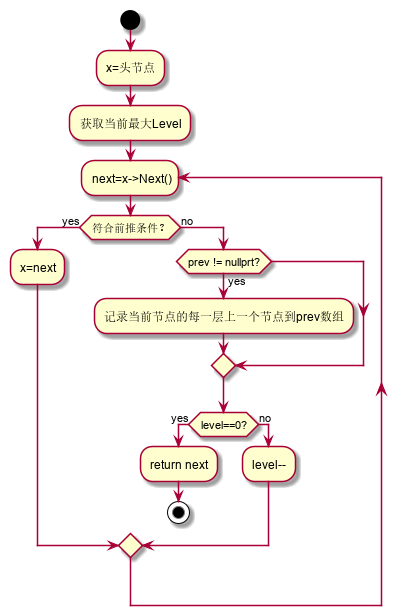

# SkipList

### Ski List简介
> 跳表是一种神奇的数据结构，插入、删除、查找元素的时间复杂度跟平衡树都是一样量级的，时间复杂度都是`O(log N)`，跳表巧妙地通过概率操作来维护索引简化了插入和删除的代码复杂度，在工业中，跳表也会经常被用到，如Redis，LevelDB，memSQL。

### SkipList结构


```c++
  struct SkipList<Key, Comparator>::Node {
     public:
     // key
     Key const key;
     private:
     // next ptr vector
     std::vector<std::shared_ptr<Node>> next_; //12
	 // constructor
     ...
   };
```

* 头节点：单链表中，有时候我们在单链表的第一个结点（有效元素）之前附设一个结点，称之为头结点，对于头结点，**数据域可以不存储任何信息，也可存储如链表长度等附加信息**。
  * 有了头结点后，对在第一个元素结点前插入结点和删除第一个结点，其操作与对其它结点的操作统一了。
  * 有了头节点后，空链表与非空链表处理一致。

```c++
template <typename Key, class Comparator>
class SkipList {
 private:
	// Immutable after construction
    Comparator const compare_;        
    // 头节点
    std::unique_ptr<Node> head_;
    // Read/written only by Insert().
    Random rnd_;
    // record the node number in every heights
    // map Ascending order the last one first meas the max height.
    std::map<int, int> heights;
};
```

* 结构图中的头节点由head_变量体现，在本实现中，head->key存储的是0，并没有用来存储SkipList的长度。
* NIL尾节点用空指针nullpter来体现，没有像一些实现中一样为之创建一个key无限大的Node，更节省空间。

### 时间复杂度

​	链表的时间复杂度和空间复杂度与其实现高度升级的概率有关，以下分析是根据概每一层的晋升概率 `p=1/2` 进行的。从概率上最小`Level = 1` 的节点数占1/2，`Level = 2`的节点数占 1/4 ...以此类推。
cong
* 决定Max Level 

  假如跳表的总元素有N，根据William Pugh论文指出，其MaxLevel应符合下式。
  


  >Since we can safely cap levels at L(n), we should choose MaxLevel = L(N) (where N is an upper bound on the number of elements in a skip list). If p = 1/2, using MaxLevel = 16 is appropriate for data structures containing up to 2^16 elements。

* 空间复杂度 `O(N)`

  ​	从第二层到第一层求和其索引节点个数：
  


* 时间复杂度`O(log N)`

  


​      按上面的概率,也就是在理想情况下每两个元素提提高一层, 如图上图所示，现在到达第 k 级索引，我们发现要查找的元素 x比 y 大比 z 小，所以，我们需要从 y 处下降到 k-1 级索引继续查找，k-1级索引中比 y 大比 z 小的只有一个 w，所以在 k-1 级索引中，我们遍历的元素最多就是 y、w、z，发现 x 比 w大比 z 小之后，再下降到 k-2 级索引。所以，k-2 级索引最多遍历的元素为 w、u、z。其实每级索引都是类似的道理，每级索引中都是两个结点抽出一个结点作为上一级索引的结点。 现在我们得出结论：**在非常理想情况下**当每级索引都是两个结点抽出一个结点作为上一级索引的结点时，每一层最多遍历3个结点。

跳表的索引高度` h = log2 N`，且每层索引**最多**遍历 3 个元素。所以跳表中查找一个元素的时间复杂度为`O(3*log N)`，省略常数即：`O(log N)`。

## public API

```c++
template <typename Key, class Comparator>
class SkipList {
 private:
    ....
 public:
  // constructors and destructors
    ....
  // Insert key into the list.
  void Insert(const Key& key);
  // Returns true  iff remove the key  successfully in the list iff the list
  // contains the key
  bool Remove(const Key& key);
  // Returns true iff an entry that compares equal to key is in the list.
  bool Contains(const Key& key) const;
  // Print the skiplist bottom-up.
  void Dump() const;
  // return the max height.
  inline int GetMaxHeight() const { return heights.rbegin()->first; }
  // Iteration over the contents of a skip list
  class Iterator {
   public:
    // Initialize an iterator over the specified list.
    // The returned iterator is not valid.
    explicit Iterator(const SkipList* list);

    // Returns true iff the iterator is positioned at a valid node.
    // valid indicates the iterator is not nullptr
    bool Valid() const;
    // Returns the key at the current position.
    // REQUIRES: Valid()
    const Key& key() const;
    // Advances to the next position.
    // REQUIRES: Valid()
    void Next();
    // Advances to the previous position.
    // REQUIRES: Valid()
    void Prev();

    // Advance to the first entry with a key >= target,may be nullptr
    void Seek(const Key& target);

    // Position at the first entry in list.
    // Final state of iterator is Valid() iff list is not empty.
    void SeekToFirst();

    // Position at the last entry in list.
    // Final state of iterator is Valid() iff list is not empty.
    void SeekToLast();

   private:
    const SkipList* list_;
    Node* node_;
  };

 private:
  enum { kMaxHeight = 12 };

  // Immutable after construction
  Comparator const compare_;
  // 头节点
  std::unique_ptr<Node> head_;

  // Read/written only by Insert().
  Random rnd_;
  // record the node number in every heights
  // map Ascending order the last one first meas the max height.
  std::map<int, int> heights;

  Node* NewNode(const Key& key, int height);
  //
  int RandomHeight();

  bool Equal(const Key& a, const Key& b) const { return (compare_(a, b) == 0); }

  // Return true if key is greater than the data stored in "n"
  bool KeyIsAfterNode(const Key& key, Node* node) const;

  // Return the earliest node that comes at or after key.
  // Return nullptr if there is no such node.
  //
  // If prev is non-null, fills prev[level] with pointer to previous
  // node at "level" for every level in [0..max_height_-1].
  Node* FindGreaterOrEqual(const Key& key, Node** prev) const;

  // Return the earliest node that comes at or after key.
  // Return nullptr if there is no such node.
  //
  // If prev is non-null, fills prev[level] with pointer to previous
  // node at "level" for every level in [0..max_height_-1].
  //
  // the difference between Fast and origin is that it does not need
  // traversal to level 0 iff the target is found before.
  Node* FindGreaterOrEqualFast(const Key& key, Node** prev) const;

  // Return the latest node with a key < key.
  // Return head_ if there is no such node.
  Node* FindLessThan(const Key& key) const;

  // Return the last node in the list.
  // Return head_ if list is empty.
  Node* FindLast() const;
};
```

## Class UML diagram



​     几个类的关系分析：Node、Iterator、Random类是SKipList类内部声明和实现的成员变量，**具有相同的生命周期**，类之间是强关系，用的是**组合**关系。

* Node 节点结构。
* Iteratior 类是读取SkipList数据时使用的，LevelDB中MemTable在读取时使用的是`SkipList::Iterator`，LevelDB这种设计的原因：相比操作容器本身，使用 iterator 总是一个好习惯，正如C++ STL的算法基本都是以迭代器作为参数。
* Random 类 LevelDB通过一定的数学技巧，用移位操作替换了更为费时的取模操作。

## 关键操作分析

### 



### FindGreaterOrEqual

  插入、查找、删除操作背后有共性操作，`FindGreaterOrEqual`即找到**相等或者大于**传入key的节点并记录下**此节点每一level的前驱节点**便于插入和删除时的链表操作。

```C++
    template<typename Key, class Comparator>
    bool SkipList<Key, Comparator>::KeyIsAfterNode(const Key &key,
                                                   SkipList::Node *node) const {
        // 不是NIL尾节点,且要查找的节点更大
        return (node != nullptr) && (compare_(node->key, key) < 0);
    }

    template<typename Key, class Comparator>
    typename SkipList<Key, Comparator>::Node *
    SkipList<Key, Comparator>::FindGreaterOrEqual(const Key &key,
                                                  SkipList::Node **prev) const {
        // new a Node x
        Node *x = head_.get();
        //  Node *x = head_;
        // get the level ,must -1
        int level = GetMaxHeight() - 1;
        while (true) {
            Node *next = x->Next(level).get();
            // forward
            if (KeyIsAfterNode(key, next)) {
                x = next;
            } else {
                // record prev for insert and remove
                if (prev != nullptr) prev[level] = x;
                // next store the ptr to a value equal or larger than key
                // when Conatins() ,return iff (compare_(x->key, key) == 0 || level == 0))
                if (level == 0) {
                    return next;
                } else {
                    // go down
                    level--;
                }
            }
        }
    }
```


### 插入

* 通过`FIndeGreaterOrEqual`找到要插入节点的后一个节点，以及前驱节点`prev`,把要插入节点的next设置为前驱节点的next,前驱节点的next设置为新插入的节点。

```c++
    template<typename Key, class Comparator>
    void SkipList<Key, Comparator>::Insert(const Key &key) {
        // for insert which need know the prev node when make op
        Node *prev[kMaxHeight];
        // return  a node >= key,here return is useless.
        FindGreaterOrEqual(key, prev);
        int height = RandomHeight();
        // iff  height is bigger than max height ,set head as prev
        if (height > GetMaxHeight()) {
            for (int i = GetMaxHeight(); i < height; i++) {
                prev[i] = head_.get();
            }
        }
        // update heghts
        if (heights.find(height) == heights.end()) heights[height] = 0;
        heights[height]++;
        // insert next ptr ops
        auto y = std::shared_ptr<Node>(NewNode(key, height));
        for (int i = 0; i < height; i++) {
            y->SetNext(i, prev[i]->Next(i));
            prev[i]->SetNext(i, y);
        }
    }
```

### 查找

* 这边使用了`FindGreaterOrEqualFast`，如果提前找到了相等的节点，会提前返回。
*  如果返回的指针的key与要找的key相等则找到，如果不相等则没找到。

```c++
    template<typename Key, class Comparator>
    bool SkipList<Key, Comparator>::Contains(const Key &key) const {
        //  Node* x = FindGreaterOrEqual(key, nullptr);
        Node *x = FindGreaterOrEqualFast(key, nullptr);
        return x != nullptr && Equal(key, x->key);
    }
```

### 删除

* 通过`FindGreaterOrEqual`查找，注意这里不能用`FindGreaterOrEqualFast`，提前返回没法确定`prev`，后续删除链表操作不能进行。

* 如果找到了相同的，将所有前驱节点指向要删除节点的后续节点。

* 什么时候下降高度？为了判断删除的当前节点是否是这一Level的最后一个节点，如果是最后一个节点需要将max level减少为删除之后的max level。

  * 维护了一个有序map<int,int> ：键为level，值是最大高度为level节点数；

    ```c++
    map<int,int> m;
    // 当skipList为空的时候也算有高度1，所以初始化skiplist的时候会将m[1]置1；
    heights[1] = 1;//{<1,1>}                          1
    // 依次插入高度为3，5的节点。
    heights[3] =0;
    heights[3]++;          // {<1,1>,<3,1>}           max level 3
    heights[5] =0;
    heights[5]++;          // {<1,1>,<3,1>,<5,1>}     max level 5
    // 再插入高度为5的节点
    heights[5]++;          // {<1,1>,<3,1>,<5,2>}     max level 5
    // 删除1个高度为5的节点
    heights[5]--;          // {<1,1>,<3,1>,<5,1>}     max level 5
    // 删除最后个高度为5的节点
    m[5]--; 
    heights.erase(5)       // {<1,1>,<3,1>,}          max level 3
    
    ```

```c++
    template<typename Key, class Comparator>
    bool SkipList<Key, Comparator>::Remove(const Key &key) {
        Node *prev[kMaxHeight];
        Node *x = FindGreaterOrEqual(key, prev);
        if (x != nullptr && Equal(key, x->key)) {
            int height = x->GetNodeHeight();
            for (int i = 0; i < height; i++) {
                prev[i]->SetNext(i, x->Next(i));
            }
            // maintain heights
            if (--heights[height] == 0) {
                heights.erase(height);
            }
            return true;
        }
        return false;
    }
```

### 修改

​    如果修改节点的key会改变节点在SkipList中的位置，需要由删除节点和插入节点来实现，实现中没有提出这个接口，需要在调用层控制。

## Random.h

* 下面是伪随机数的生成思想,在LEVELDB中的Random.h中通过数学转换用更快的移位操作代替了取模操作,不过思想是一样的。

```c
void rand(int &seed)
{
    seed = (seed * A + C ) % M; // A为16807，M为2147483647，C为0 seed初始化值是常量
}
```

* 随机获取高度传入的种子使用的是常量，而Random.h实现的是伪随机数，这会导致每次运行高度升级的顺序其实是不变的，在使用时如果插入的数据是无序的,相当于就是随机了,如果插入的数据是有序的,相当于这个跳表不算是随机生成高度的。也可以把当前的时间作为参数用来初始化种子,这样每次运行的结果都会不一样。下面是` rnd_.Next()%k 4==0`的100此结果。

  >1 0 0 0 0 0 0 0 0 1 0 0 0 0 0 0 1 0 0 1 1 0 0 0 0 0 0 0 0 1 0 0 0 0 0 0 0 0 1 0 0 0 0 0 0 0 0 0 1 0 1 0 0 0 1 0 0 1 1 0 0 0 0 0 1 0 0 0 0 0 0 0 1 1 0 0 1 0 0 0 0 0 1 0 1 0 0 0 0 1 0 0 0 0 0 0 0 0 1 0

## TODO

* 实现可并发。

### 参考文献

 [LevelDB::skipList](https://github.com/google/leveldb/blob/master/db/skiplist.h)

[LevelDB::Random.h](https://icepigzdb.com/2020/07/18/True-and-False-Random/)

[Skip List--跳表（全网最详细的跳表文章没有之一)](https://www.jianshu.com/p/9d8296562806)

