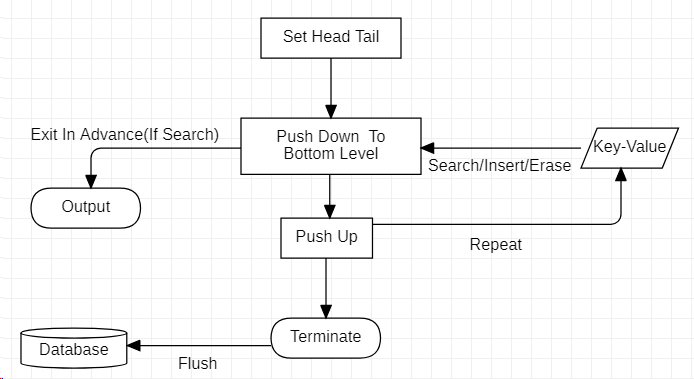
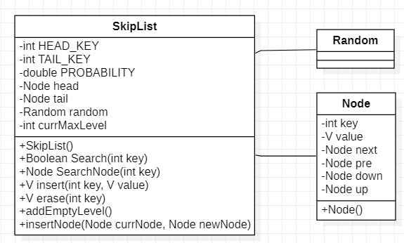

# skiplist-uml

## 流程图

    

    
     
flowchart
 

- Set Head Tail: 表示跳表的初始化操作，每层中会创建Head，Tail节点，方便插入，删除操作。
- Key-Value: 表示外界请求，请求类型为查找，插入，删除。
- Push Down To Bottom Level: 表示自顶向下查找节点在原链表中的位置。
- Output: 表示在查找过程中，找到节点之后可以提前退出。
- Push Up: 表示自底向上地进行插入和删除操作。
- Terminate: 不定期将内存中跳表写入数据化，进行持久化操作。

## 类图

    

    
     
classdiagram
 

- SkipList: 
  - HEAD_KEY, TAIL_KEY分别取int类型的最大值和最小值，用作Head和Tail的Key值。
  - 每次在原链表插入节点之后，都要以PROBABILITY的概率抛硬币，来确定是否需要升层。为了使跳表结构稳定，PROBABILITY取1/2。
  - currMaxLevel来维护跳表的最高层数。
  - Search操作会在找到节点之后返回，SearchNode操作会一直找到最底层，返回第一个大于待查找节点的前一个节点。
  - insert操作调用SearchNode，若返回节点的Key值和待插入的Key值相同，更新Value值；否则插入Key-Value Pair，并判断是否需要升层，向上逐层插入此Key-Value Pair。
  - erase操作调用SearchNode，若返回节点的Key值和待插入的Key值不同，报错；否则删除Key-Value Pair，并向上逐层删除此Key-Value Pair。
  - addEmptyNode操作在当前跳表最高层的基础上插入新的一层。
- Node: 
  - key, value储存键值，数值信息。
  - next, pre, down, up储存跳表节点的链接信息。
- Random: java.utils的接口，提供随机数。

