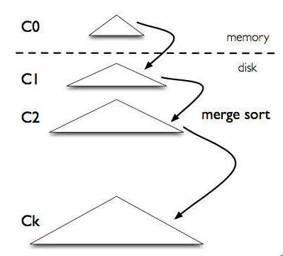

# 第2-3周实验报告

## 前言

1. 数据库索引为啥不用二叉查找树实现?

   二叉查找树的时间复杂度为O(logn)，从算法逻辑上讲查找速度和比较次数都是最小的。但是，数据量很大的时候索引大小可能达到几个G，所以数据库索引是存在磁盘上的，只有逐一加载每一个磁盘页（包含索引树的节点）。因此，在考虑算法效率的时候还需要考虑磁盘I/O次数。

   磁盘读写过程中最占用时间的是磁盘寻道，读写以块为单位。B树（B+树）采用减少读盘次数以及寻道时间，来减少检索过程中在外存上花的时间，采取的方法是充分利用盘块的空间，在一个盘块中尽可能多的存储信息，或者在连续的盘块地址上存储尽可能多的信息。在数据结构上的变化就是每个节点存储多个Key信息以及包含多个子节点。

   B树（B+树）主要用于文件系统以及部分数据库索引，比如非关系型数据库MongoDB。
   
2. 为什么使用跳表？

   部分平衡数据结构如B树，红黑树，AVL 树之类的，实现起来都非常复杂，相比之下跳表的原理非常简单，实现起来也比较简单。作为轻量级的数据结构，它的效率却和红黑树不分上下，所以跳表也是经常使用。

## B树

### 基础概念

二叉排序树多数情况能够达到预期的查找效率，但是每个节点只能储存一个元素，只能有两个孩子。大量数据的情况下，二叉排序树的深度会特别大，多次查找访问效率会下降，插入数据后可能会破坏树的平衡性（可以通过使用AVL树来缓解这种情况）。

一种解决方式是将二叉查找树转变为多路查找树，就是说每个节点存储的数据可以多于一个，每个节点的孩子数量可以多于一个。在多路查找树的基础上，加上一些限制条件，就得到了多路平衡查找树，或称为B树（B-树）。

m阶B树具体有如下5条定义：

1. 根节点至少有两个子女。
2. 每个中间节点都包含k个关键字，其中m/2 <= k <= m-1。
3. 每一个叶子节点都包含k个关键字，其中m/2 <= k <= m-1。
4. 所有的叶子节点都位于同一层。
5. 每个节点中的元素从小到大排列，节点当中k-1个元素正好是k个孩子包含的元素的值域分划。

每个B树节点储存了关键字key，关键字对应的数据value，以及孩子节点指针，在文件系统中，数据value是该键对应条目在硬盘上的逻辑地址。

### 基础操作

#### 插入操作

如果B树中已存在需要插入的键值key，则用需要插入的value替换旧的value。若B树不存在键值key，则一定是在叶子节点中进行插入操作。

1. 根据要插入的key值，找到叶子节点并插入。

2. 判断当前节点key的个数是否小于等于m-1，若满足则结束，否则进行第3步。

3. 以节点中间的key为中心分裂成左右两部分，然后将这个中间的key插入到父节点中，这个key的左子树指向分裂后的左半部分，这个key的右子支指向分裂后的右半部分，然后将当前节点指向父节点，继续进行第2步。

#### 删除操作

删除操作是指，根据key删除记录，如果B树中的记录中不存对应key的记录，则删除失败。

1. 如果当前需要删除的key位于非叶子节点上，则用后继key覆盖要删除的key，然后重复在后继key所在的子支中删除该后继key。最后的后继key一定位于叶子节点上，删除这个记录后执行第2步。

2. 该节点key个数大于等于m/2，结束删除操作，否则执行第3步。

3. 如果兄弟节点key个数大于m/2，则父节点中的key下移到该节点，兄弟节点中的一个key上移，删除操作结束。否则，将父节点中的key下移与当前节点及兄弟节点中的key合并，形成一个新的节点。原父节点中的key的两个孩子指针就变成了一个孩子指针，指向这个新节点。然后当前节点的指针指向父节点，重复上第2步。

有些节点它可能即有左兄弟，又有右兄弟，那么我们任意选择一个兄弟节点进行操作即可。

## B+树

### 基础概念

1. B+树包含2种类型的节点：内部节点（也称索引节点）和叶子节点。根节点本身即可以是内部节点，也可以是叶子节点。根节点的关键字个数最少可以只有1个。

2. B+树与B树最大的不同是内部节点不保存数据，只用于索引，所有数据（或者说记录）都保存在叶子节点中。

3. m阶B+树表示了内部节点最多有m-1个关键字（或者说内部节点最多有m个子树），最少有m/2个关键字，阶数m同时限制了叶子节点最多存储m个记录。
4. 内部节点中的key都按照从小到大的顺序排列，对于内部节点中的一个key，左树中的所有key都小于它，右子树中的key都大于等于它。叶子节点中的记录也按照key的大小排列。

5. 每个叶子节点都存有相邻叶子节点的指针，叶子节点本身依关键字的大小自小而大顺序链接。

### B+树的优势

1. 单一节点存储更多元素：B+树中间节点没有卫星数据（也就是说只包含索引信息），所以每个非叶子节点可以包含更多的内容，同样大小的磁盘页可以容纳更多的节点元素。也就是说B+树会在相同数据量的情况下比B树更加“矮胖”，查询的IO次数更少。
2. 查询效率稳定：B+树的查询必须最终找到叶子节点，而B树如果在中间节点找到匹配的即可（最好情况是只查根节点，最差是查到叶子节点），而B+树每一次都是稳定的。B-树的好处是，虽然查询性能不稳定，但平均的查询速度快一些。
3. 范围查询简便：B树的范围查询只能依靠繁琐的中序遍历，找到下限和上限。而B+树的范围查询很简单，只需要在叶子节点那一层的链表上做遍历就行。

### 基本操作

#### 插入操作

1. 若为空树，那么创建一个节点并将记录插入其中，此时这个叶子节点也是根节点，插入操作结束。

2. 针对叶子类型节点：根据key值找到叶子节点，向这个叶子节点插入记录。插入后，若当前节点key的个数小于等于m-1，则插入结束。否则将这个叶子节点分裂成左右两个叶子节点，左叶子节点包含前m/2个记录，右节点包含剩下的记录，将第m/2+1个记录的key进位到父节点中，进位到父节点的key左孩子指针向左节点，右孩子指针向右节点。将当前节点的指针指向父节点，然后执行第3步。

3. 针对索引类型节点：若当前节点key的个数小于等于m-1，则插入结束。否则，将这个索引类型节点分裂成两个索引节点，左索引节点包含前(m-1)/2个key，右节点包含m-(m-1)/2个key，将第m/2个key进位到父节点中，进位到父节点的key左孩子指向左节点,，进位到父节点的key右孩子指向右节点。将当前节点的指针指向父节点，然后重复第3步。

#### 删除操作

1. 如果叶子节点中没有相应的key，则删除失败，否则执行第2步。
2. 删除叶子节点中对应的key。删除后若节点的key的个数大于等于m/2，删除操作结束，否则执行第3步。
3. 若叶子节点的key的个数小于m/2，且兄弟节点key有富余（大于m/2），向兄弟节点借一个记录，同时用借到的key替换父节点（指当前节点和兄弟节点共同的父节点）中的key，删除结束。否则执行第4步。
4. 若叶子节点的key的个数小于m/2，且兄弟节点中没有富余的key（小于等于m/2），则当前节点和兄弟节点合并成一个新的叶子节点，并删除父节点中的key，将当前节点指向父节点，执行第5步。
5. 若索引节点的key的个数大于等于m/2，则删除操作结束。否则执行第6步。
6. 若兄弟节点有富余，父节点key下移，兄弟节点key上移，删除结束。否则执行第7步。
7. 当前节点和兄弟节点及父节点下移key合并成一个新的节点。将当前节点指向父节点，重复第5步。

## 跳表

### 基础概念

在单链表的基础上，逐层挑出部分节点作高层的链表，其中一个节点的最高层可以看作随机变量，应该满足参数为1/2的几何分布，随机变量的期望值为2。

### 基本操作

#### 查找操作

从最高层开始，如果当前指针指向的节点小于被查找的节点，那么将指针往后移一位；如果当前指针指向的节点等于被查找的节点，那么返回查找到的值；否则，将指针往下移动一层，若指针已经无法继续向下移动，则跳表中不存在需要寻找的节点。

#### 插入操作

在插入过程中，首先根据参数为1/2的几何分布确定新插入节点的在跳表中的最高层数，最后从最底层开始，自底向上地在每层链表中插入新增加的节点。时间复杂度为O(logN)。

#### 删除操作

在删除过程中，首先确定待删除节点在跳表中的最高层数，然后从最高层开始，自顶向下地在每层链表中删除待删除的节点。时间复杂度为O(logN)。

### 代码实现

[skiplist的代码请查看](./code-java/skiplist)

[UML建模请查看](./skiplist-uml.md)

## LSM树

### 基础概念

LSM-tree起源于 1996 年的一篇论文The Log-Structured Merge-Tree (LSM-Tree)。其中Log-Structured是日志结构的，日志是系统打印出来的，一页一页地往下写，不需要更改，只需要append操作。Merge-Tree就是可以将树结构进行合并。LSM-Tree是专门为key-value存储系统设计的，最大特点就是写入速度快，主要利用了磁盘的顺序写。LSM-Tree采用多层结构（如图LSM-structure所示），内存中的C_0层保存了所有最近写入的k-v，这个内存是有序的，并且可以随时原地更新，同时支持随时查询。剩下的C_1到C_k层都在磁盘上，每一层都是在key上有序的结构。

    

    
     
LSM_structure
 

### 写入操作

一个 put(k，v) 操作来了，首先追加到写前日志（Write Ahead Log，也就是真正写入之前记录的日志）中，接下来加到 C_0 层。当C_0层的数据达到一定大小，就把C_0 层和C_1层合并，类似归并排序，这个过程就是Compaction（合并）。合并出来的新的 new-C_1会顺序写磁盘，替换掉原来的old-C_1。当 C_1层达到一定大小，会继续和下层合并。合并之后所有旧文件都可以删掉，留下新的。

注意数据的写入可能重复，新版本需要覆盖老版本。什么叫新版本，我先写a=1，再写a=233，233 就是新版本了。假如 a 老版本已经到C_k层了，这时候C_0层来了个新版本，这个时候不会去管底下的文件有没有老版本，老版本的清理是在合并的时候做的。

写入过程基本只用到了内存结构，Compaction 可以后台异步完成，不阻塞写入。

### 查询操作

在写入流程中可以看到，最新的数据在C_0层，最老的数据在C_k层，所以查询也是先查C_0层，如果没有要查的k，再查C_1，以此逐层查找。

一次查询可能需要多次单点查询，稍微慢一些。所以LSM-Tree主要针对的场景是写密集、少量查询的场景，不直接修改磁盘中的数据（因为这样会破坏物理块的连续性）。Merge操作可以重新排列数据在物理块中的顺序，减少磁盘询道花费的时间。

## TODO

1. 尝试过按自己的思路实现B+树，不过逻辑结构比较混乱，所以bug比较多。接下来会参考别人的代码，弄清楚B+树的实现过程。
2. skiplist实现过程中，插入和删除节点的操作都是从最底层开始进行的，需要提前找到原链表中待插入（删除）节点的位置，可能会有更加高效地方法。