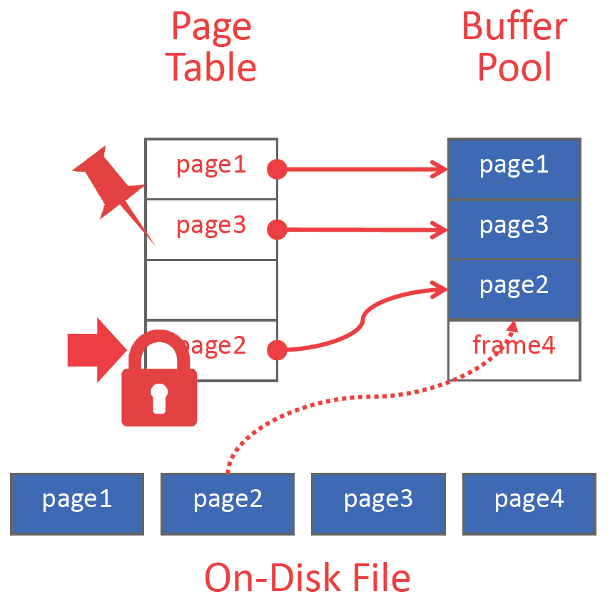
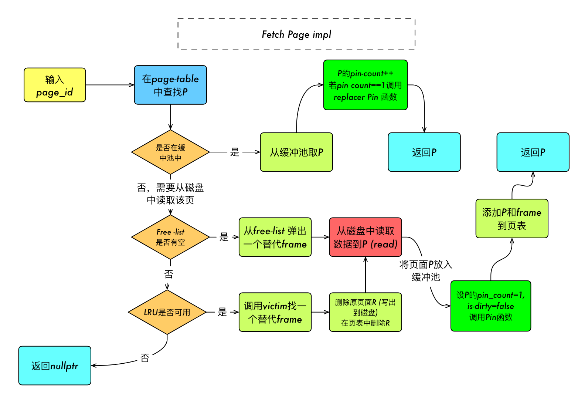
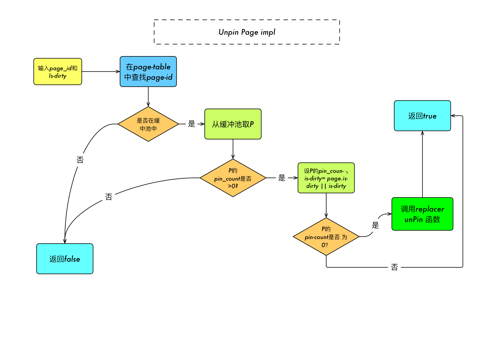
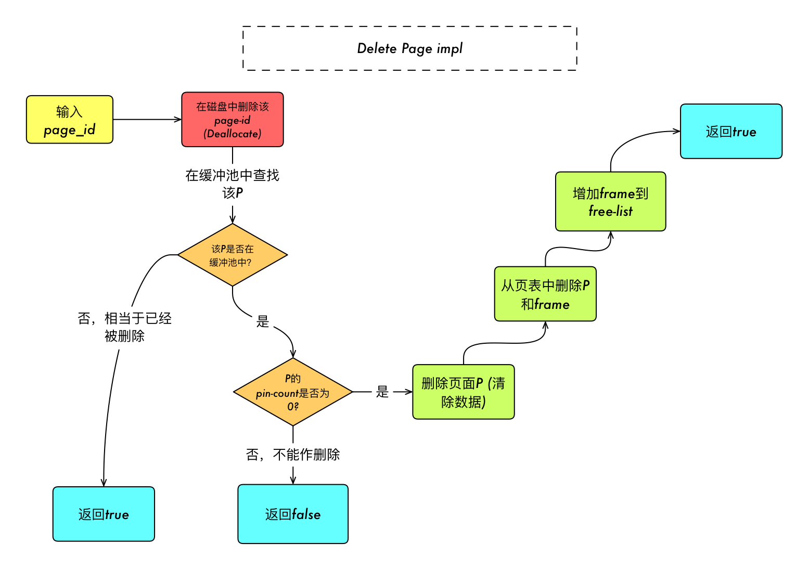
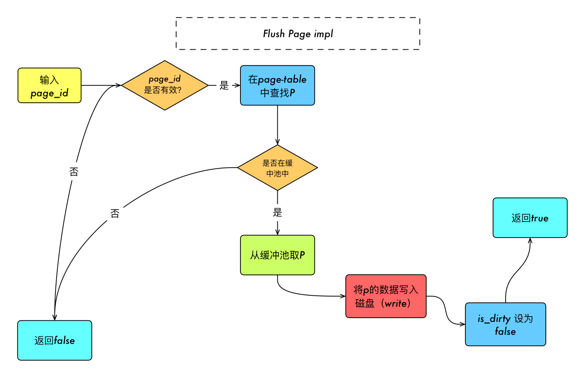

# Buffer Pool基础知识和项目流程

2021.10.8

by Group2
陈思芹，郑前祎，侯磊，王昊龙

## 基本概念

缓冲池（Buffer Pool）是DBMS分配的一片内存区域，用于存储从磁盘中获取的页面，以提高访问数据的速度。负责缓冲池空间分配的子系统称为缓冲池管理器。

这片内存空间被组织为一个数组，其中每个数组项被称为一个帧（frame），一个帧正好能放置一个页面（page）。

当一个页面被请求时，DBMS首先搜索缓冲池，如果在缓冲池中没有找到该页，就从磁盘获取该页的副本，并放置到缓冲池的一个帧中。

缓冲池的组织结构如下图所示。

## 内部结构

在本次实验中，缓冲池管理器的内部数据结构如下：

+ **缓冲池（pages）**：一个数组，大小和Page相同，长度和pool_size相同，以frame_id作为索引，存放页面。

+ **页表（page table）**：一个哈希表，将page_id映射到frame_id，对应缓冲池中一个帧的位置。

+ **空闲列表（free list）**：一个frame_id的链表，存储缓冲池的空闲frame。如果要从磁盘中加载新的页，将优先从free list中选取空位。

+ **页面（Page）**：一个数据结构，包括以下组成：

 + page_id：页面序号，和具体存储位置无关。

 + pin_count：一个引用计数，统计当前有多少进程正在使用该页面。
 当pin_count>0，表示页面被锁定，不能与磁盘交换；
 当pin_count=0，表示没有进程使用该页面，可以与磁盘交换。

  + is_dirty：一个标志位，表示页面从磁盘中载入到缓冲池后，是否有进程对其做了修改。

  + data：页面数据。

缓冲池管理器还包括一个replacer，用来实现替换策略。实验中用到的IRUreplacer的内部结构如下：

+ 替换帧列表（frame_list）：一个frame_id的链表，用于存储缓冲池中已存储页面并可供替换的帧。pin_count>0的帧不在其中，只有pin_count=0的帧才可能在里面。

## 流程

主要需要实现两个部分：LRU置换和Buffer Pool Manager。

### LRU置换实现

LRU：最近最少使用置换算法，即选择最近最久未使用的页面予以淘汰。

实现：创建一个队列，依次把最近使用过的页面加入队头，每次需要置换时从队尾取出。使用list存储即可，为了减少复杂度增加一个Map。

+ Unpin()：从buffer pool中取消 在lru_replacer中添加一个元素 (Pin()相反)

+ Victim()：取出队尾节点，并在map中删除它的映射关系。

为了后面buffer pool manager做准备。

### buffer_pool_manager:

需要完成6个函数。下面记录一下各函数的流程：

#### FetchPageImpl

#### NewPageImpl

#### UnpinPageImpl

#### DeltePageImpl

#### FlushPageImpl

#### FlushALLPageImpl

