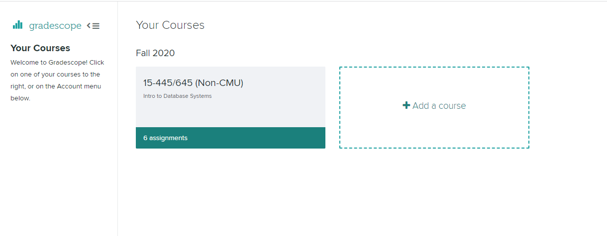

# Buffer Pool 环境搭建和代码运行记录

2021.10.8

by Group2
陈思芹，郑前祎，侯磊，王昊龙

---

## 1. 环境搭建

### 回退版本，从去年的项目建立新分支

项目地址：https://github.com/cmu-db/bustub

切换到Commits on Apr 6, 2021，（349cea），进入项目的历史版本，fork一个分支到本地。

新建一个自己的分支：bustub-xxx，并将其设置为默认分支。

### 环境准备

1. Clone项目到本地:
   ```
   $ git clone xxx
   ```
2. 运行一个ubuntu容器，并将容器的files文件挂载到用户的ubuntu目录：

  ```bash
  $ docker run -itd --name ubuntu -p 28080:8080 -v /home/xxx/ubuntu:/files ubuntu /bin/bash
  ```
3. 进入容器：
  ```
  $ docker exec -it ubuntu /bin/bash
  ```

### 构建

1. 进入项目bustub，在linux上构建:
 ```
 $ build_support/packages.sh
 ```

 2. 执行如下命令：

 ```
 $ mkdir build
 $ cd build
 $ cmake ..
 $ make
 ```

## 2.测试
### 测试环境创建

1. 为实现单独运行各个测试，进入test目录中，对于待测试的lrureplacer_test.cpp和buffer_pool_manager_test.cpp文件，将Test中待调试中函数相应的参数中的DISABLED_前缀去掉，比如：

 ```C++
  TEST(BufferPoolManagerTest, DISABLED_SampleTest) {
    ...
  }
  ```
更改为：
  ```C++
   TEST(BufferPoolManagerTest, SampleTest) {
     ...
   }
   ```
然后再进行测试。

2. 执行如下命令，单独运行每个测试。
+ lru_replacer:
```
$ mkdir build
$ cd build
$ make buffer_pool_manager_test
$ ./test/buffer_pool_manager_test
```
+ buffer_pool_manager:
```
$ cd build
$ make buffer_pool_manager_test
$ ./test/buffer_pool_manager_test
```

3. 也可以通过checke-tests进行全部的测试：

  ```
 $ cd build
 $ make check-tests
 ```

### 调试
1. 启用debug功能：
```
$ mkdir build
$ cd build
$ cmake -DCMAKE_BUILD_TYPE=DEBUG ..
$ make
```

2. 不要使用print语句调试，若需要打印，可启动log来进行调试。需要在代码文件中引入头文件：
```
#include "common/logger.h"
```
然后加入类似print的打印信息：
```
LOG_INFO("# Pages: %d", num_pages);
LOG_DEBUG("Fetching page %d", page_id);
```

3. 语法检查（选用）

  ```
$ make format
$ make check-lint
$ make check-clang-tidy
```

## 3.将代码上传至课程网页进行打分
### 账号注册

进入https://www.gradescope.com/courses/163907/ 登陆。

若无账号，首先在https://www.gradescope.com/ 中注册一个账号。6位课程码为：5VX7JZ。这是专供外校人员测试的课程码。

注册后再重新登陆。

### 提交自己的代码

进入课程15-445/645，点击submit提交。



只需要包含以下四个文件，目录上必须保证一致:

+ src/include/buffer/lru_replacer.h
+ src/buffer/lru_replacer.cpp
+ src/include/buffer/buffer_pool_manager.h
+ src/buffer/buffer_pool_manager.cpp

为了能够提交成功，最好是打包成zip压缩文件并按目录整理，命名为：project1-submission.zip。

提交后可查看代码结果。可多次重复提交。

 ## 问题
1. 无法连接googletest
  > 解决：clone到本地时使用http:代替https:
