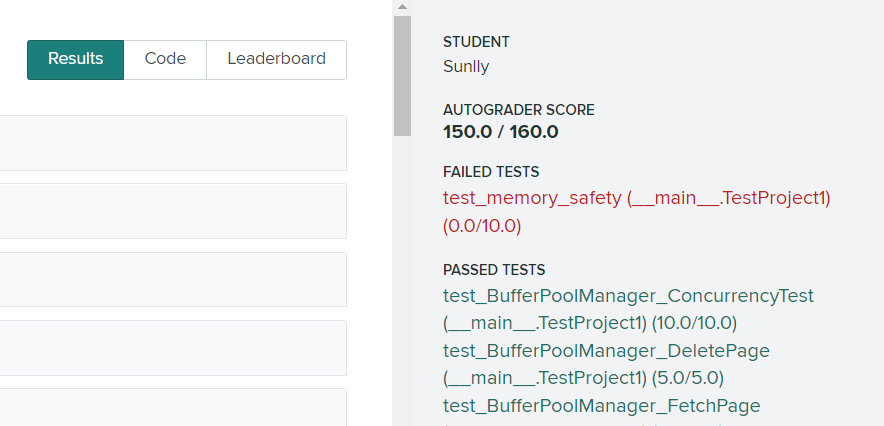

# Buffer Pool项目实现情况

2021.10.8

by Group2
陈思芹，郑前祎，侯磊，王昊龙

---

## 1. 陈思芹

### 测试结果

均顺利通过本地测试用例的测试：

LRUreplacer：


LRUreplacer：


课程网站的测试达到150分，除内存安全外均通过。



### 遇到的问题

##### LRUreplacer

1. 容器size的不匹配问题：测试用例采用了Unpin两次，程序将frame都加入了list

  ```
3: /files/bustub/test/buffer/lru_replacer_test.cpp:33: Failure
3: Expected equality of these values:
3:   6
3:   lru_replacer.Size()
3:     Which is: 7
```
解决：在Unpin函数中，加入对元素是否在list中的检查。如果在list则不做元素的添加。（一般不会出现Unpin两次这种情况，但是测试用例就加入了这样的情况）

##### buffer_pool_manager

1. 内存错误

  解决：此报错一般是指针引用出现了问题。这里将判断指针为空的方式从```if(！point)```改为```if(point!=nullptr)```。

2. 忘记将被替换的页面从页表中删除。使用如下语句删除旧页和增加新页：

  ``` C++
page_table_.erase(page_id_replace);
page_table_.insert({page_id_new,frame_id_replace});
```


3. 加锁以防止多线程调用，在各函数的具体实现前加上，如：
``` C++
Page *BufferPoolManager::FetchPageImpl(page_id_t page_id) {
  std::lock_guard<std::mutex> lock(latch_);
  ...
}
```
  目前仅在函数层面上加锁，后续可进一步细化上锁的粒度。

##### 网上测试遇到的细节问题

1. 误在FetchPage、FlushAllPages函数中调用FlushPage，造成错误。注意加锁后的函数不能相互调用彼此，不然会出现死锁情况。

2. 忽略了INVALID_PAGE_ID：在flushPage实现前应该检查page_id是否无效；在deletePage时应将被删除的页的page_id设置成无效。

3. 在deletePage时也要调用replacer->Pin()，将页面从替换帧列表中清除。

### 总结

通过动手编程实践，我对缓存池的原理有了较为深入了解，C++的编程能力也得到了提升。小组同学都很厉害（至少比我这个菜鸟强），通过和小组同学的交流讨论、不断请教，我遇到的许多问题都及时得到了解决，从他们身上也学到很多学习方法和编程、调试技巧。项目收获非常大，很有成就感，为后续的任务打下基础。

---

## 2.郑前祎


### 实现及测试

本地测试：

 

 

在线测试：


### 过程中遇见的问题及解决

#### 问题一

LruReplacer无法通过测试。

错误原因：在对Unpin函数的处理上理解有误。正确的理解应该是调用Unpin时，如果Lru里没有该page_id，则将该page_id加入，如果已经有这个page_id则不进行处理。

解决：修改Unpin函数的实现。

#### 问题二

使用细粒度锁以实现更高的并发性时，会导致死锁。

错误原因：为了得到更高的并发性，选择对类中的私有成员变量单独加锁，则有三个锁：mu_page_table、mu_free_list、mu_page_。在对锁进行申请和释放时，容易造成死锁，并且其中函数嵌套调用时也难以处理锁的正确性。

解决：简化锁的实现，对函数进行加锁。

### 总结

本周的学习过程中，结合BufferPool的项目，学习了很多数据库的基本知识，并且在此基础上自己去理解和实现，有非常大的收获。在写项目的过程中，学习了很多C++的知识，也极大提高了自己的编程能力，为之后的项目打下了基础。

---

## 3. 侯磊

### 实现及测试
##### 本地测试：


##### 在线测试：


  

### 过程中遇到的问题及解决：

UnpinPageImpl()无法通过测试。

错误原因：在实现FetchPage时有一个位置的Unpin(*)，参数错误的使用了page_id而不是frame_Id，但是测试过程中没有在这里报错，而是在另一个函数中。

解决：在本地Test中额外写了测试用例定位到错误。

### 总结

通过学习和实践完成了BufferPool的项目，学到了有关缓冲池的基本知识，使自己的代码能力有了一定提升。在实践项目的过程中，使用GoogleTest进行单元测试，了解并学会了其基本功能；同时初次学会使用mutex在编程中实现并发安全，这些都让我有很大的收获，同时为后续的任务打下基础。

---

## 4. 王昊龙

### 过程中遇到的问题及解决：

1. 在实现FetchPageImpl与NewPageImpl时，有相同的的取页过程，将其整合为一个函数使得代码更加简洁

2. 在实现Unpin中，得判断链表中的元素个数是否超过capacity，如果超过，得将最后的元素删减一直到可以再容纳一个Unpin的页

3. 在实现manager功能时基本都需要判断是否存在该page

4. 在实现FlushPageImpl中还得判断page中是否有物理页（if(page_id == INVALID_PAGE_ID)）
