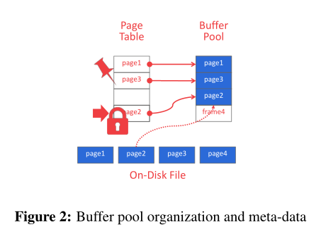
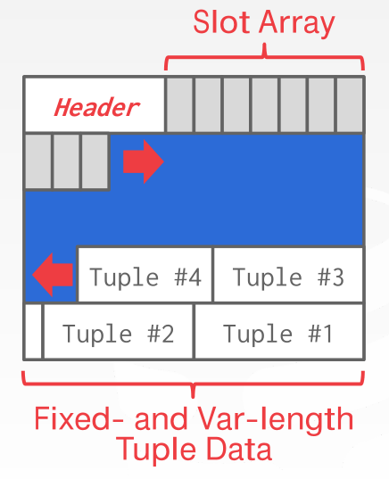
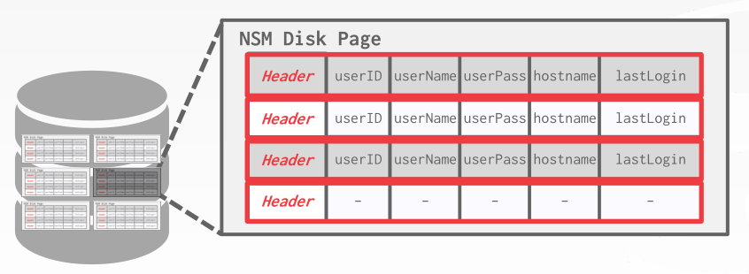
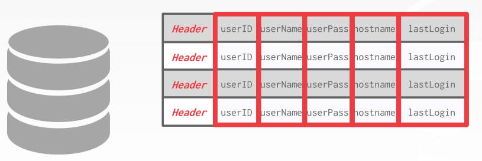
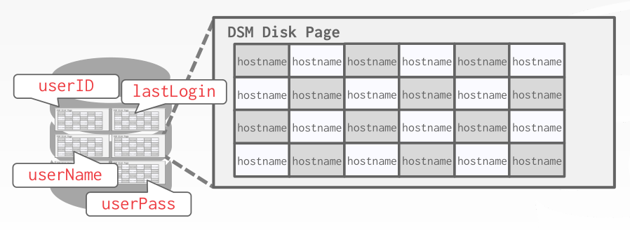

# Buffer Pool

1. 缓冲池在内存中，用于存储从磁盘中读取页面。  
数据库以文件的形式在磁盘中，DBMS将文件表示为页面的集合。  

2. 基础概念：
	+ page：磁盘中的固定大小的数据块，用页面id区分
	+ page directory：用于在磁盘上找到给定页面id的页面，是从页面id到页面位置的映射
	+ page table：是内存中的一个哈希表，是从页面id到页面副本在缓冲池中帧位置的映射
	+ frame：存储页面的数组项
	+ dirty flag：表示进程是否对页面进行修改。如果修改了表示存储管理器必须将该页写回磁盘
	+ pin counter：表示当前访问该页面的进程数。如果计数大于零，则该页不允许被替换出

3. 页面布局：
两种方法：slotted-pages和log-structured
	* slotted-pages：  

	* log-structured:  
存储日志记录  
写快，读慢

4. 工作负载
	* OLTP（在线事务处理）   
特点：快速、短时间运行的操作、一次操作单个实体的简单查询、可以重复操作  
适合处理写操作多的
	* OLAP（在线分析处理）  
特点：长时间运行、复杂的查询、可读取大部分数据库  
适合处理读操作多的
	* HTAP（混合事务+分析处理）

5. 存储模型：
	* NSM（n元存储模型）  
“行存储”  适合OLTP  
将单个元组的所有属性连续存储在单个页面中  
优点：快速插入、更新和删除  
缺点：不适合扫描表的大部分与/或属性的子集  

	* DSM（分解存储模型）  
“列存储”   适合OLAP  
将所有元组的单个属性(列)连续存储在一个数据块中  
优点：减少查询执行过程中浪费的工作量  
缺点：点查询、插入、更新和删除速度很慢  
  

6. Buffer替换策略
	* LRU（最近最久未使用）
使用一个单独的数据结构（例如队列）存储时间戳
	* CLOCK