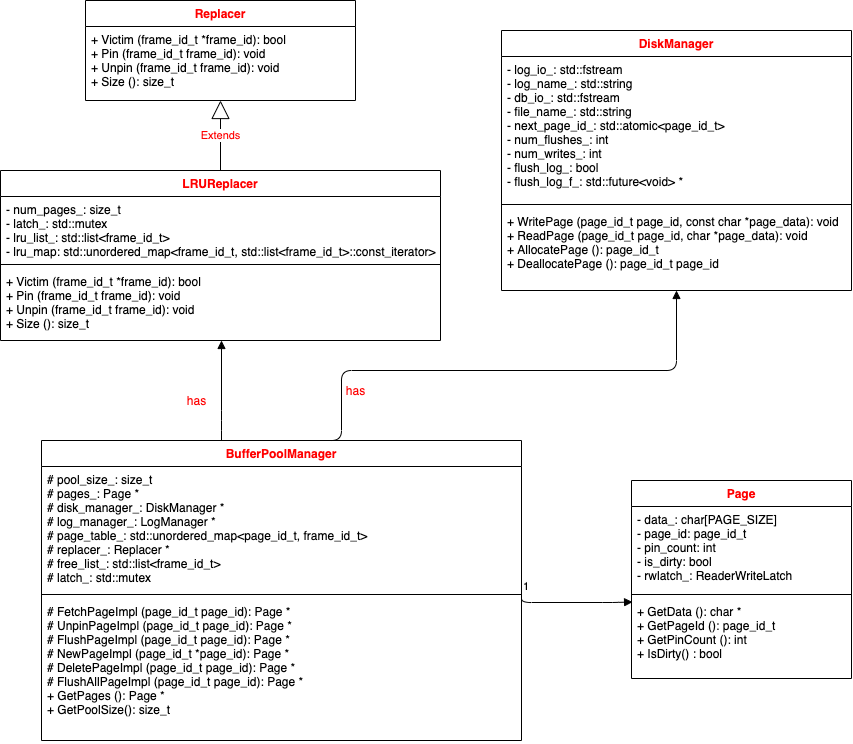

# 实现过程

涉及到如下组件：

- **缓冲池管理器（Buffer Pool Manager）**中的组件：
  - **缓冲池（Buffer Pool）**：负责从磁盘读取页面装入到内存帧中，以及将页面写会磁盘。磁盘上的页面（page）实际缓存在内存的帧（frame）中。
  - **页表（page table）**：负责管理磁盘页面标识符（page_id）到内存帧标识符（frame_id）的映射。
  - **置换器（Replacer）**：维护未被引用（unpinned）的内存帧（frame），当在缓冲池创建一个新的页面（NewPage）或者从磁盘获取一个页面（FetchPage）时，这些内存帧作为置换的候选集将被考虑，如何置换具体取决于选择的置换策略（这里提供了 LRU 和 Clock 两种置换策略）。
  - **空闲帧列表（free list）**：维护未使用的内存帧（frame），当在缓冲池创建一个新的页面（NewPage）或者从磁盘获取一个页面（FetchPage）时需要首先考虑从中获取未使用的帧。
- **磁盘管理器（Disk Manager）**：负责处理磁盘IO，操作包括：分配/取消分配，读/写页面的数据。
- **日志管理器（Log Manager）**：暂时没有用到。

内存帧（frame）状态：

- free：空闲状态，未装入页面
- pinned：**被引用**，表明其中的页面在缓冲池中但**不允许置换**
- unpinned：**未引用状态**，表明其中的页面在缓冲池中且**允许置换**

## LRU Replacer（最近最少使用置换策略）

涉及到如下文件：

- ` src/include/buffer/lru_replacer.h`
- `src/buffer/lru_replacer.cpp`

需要实现以下方法：

- `Victim(T*)`：在置换器记录的所有元素中，移除最近最少访问的对象，将其内容存储在输出参数中并返回 True。如果 Replacer 为空返回 False。（根据置换策略选择一个内存帧中的页面进行移除）
- `Pin(T)`：在将页面固定到 BufferPoolManager 中的内存帧（frame）后，应调用此方法。它应该从 LRUReplacer 中删除包含固定页面的框架。（表示该内存帧中的页面正在被引用，不能参与置换策略）
- `Unpin(T)`：当页面的引用计数（pin_count）变为 0 时，应调用此方法。此方法应将包含未固定页面的内存帧（frame）添加到 LRUReplacer。（取消引用内存帧中的页面，使其能够参与置换策略）
- `Size()`：此方法返回当前在 LRUReplacer 中的帧（frame）数量。

注意事项：

- Victim()、Pin()、Unpin() 三个函数的实现需要用到锁（latch），因为会存在多个线程同时访问置换器的情况。
- 需要保证 Pin() 函数找到指定帧的时间复杂度为 `O(1)`，UnPin() 函数同理。
  - 具体实现：双向链表+哈希表，通过哈希表来实现O(1)的时间复杂度访问链表中的任何一个节点，通过双向链表来记录页面的访问顺序，同时O(1)的时间复杂度插入和删除节点。
- UnPin() 函数被调用不能说明该页面之前被使用（置换器可能已经包含该页面，不应该再将该页面设置为“最近”）。

## Buffer Pool Manager（缓冲池管理器）

涉及到如下文件：

- `src/include/buffer/buffer_pool_manager.h`
- `src/buffer/buffer_pool_manager.cpp`

需要实现以下方法：

- `FetchPageImpl(page_id)`：**从缓冲池中获取页面。**
  - 如果请求的页面已经在缓冲池中，则可以立即取走，做一次 Pin() 操作，表明该页面被使用。
  - 否则，需要从磁盘读取页面到缓冲池中。
    - 如果缓冲池未满，将空闲空间分给从磁盘读取的页面。
    - 否则，通过置换器选择一个最近最少未使用的页面移除，再将其空出的空间分给从磁盘读取的页面。
- `NewPageImpl(page_id)`：**在磁盘新建页面，并加载到缓冲池中。**
  - 如果缓冲池已满且所有页面都被引用，即无法移除任何一个页面。
  - 如果缓冲池未满，则使用空闲帧（frame）装入从磁盘写入的页面（page）。
  - 否则，通过置换器移除一个页面，并检查其是否为脏页，是则写回磁盘。然后将从磁盘读取的页面装入缓冲池，更新页面元信息和页表。
- `UnpinPageImpl(page_id, is_dirty)`：**取消引用指定页面**。
  - 将页面的引用计数减 1。
  - 如果页面的引用计数为 0，则调用置换器的 Unpin() 函数，将该页面加入置换器。
- `FlushPageImpl(page_id)`：**将指定页面写回磁盘。**
  - 如果页面为脏，才写回磁盘。
- `DeletePageImpl(page_id)`：**删除磁盘页面，同时从缓冲池中移除。**
  - 如果当前页面没有被引用，才可以删除。
  - 在页表中删除该页面对应的条目，同时将该页面所在帧加入空闲帧列表。
- `FlushAllPagesImpl()`：**将缓冲池中的所有页面写回磁盘**。
  - 对于缓冲池中的每一个页面，调用 FlushPageImpl(page_id) 函数。

