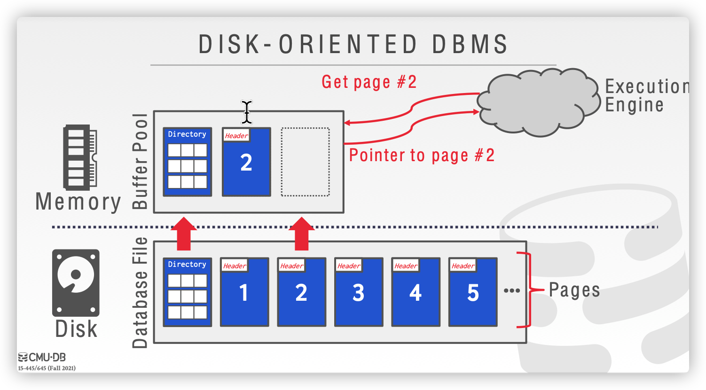
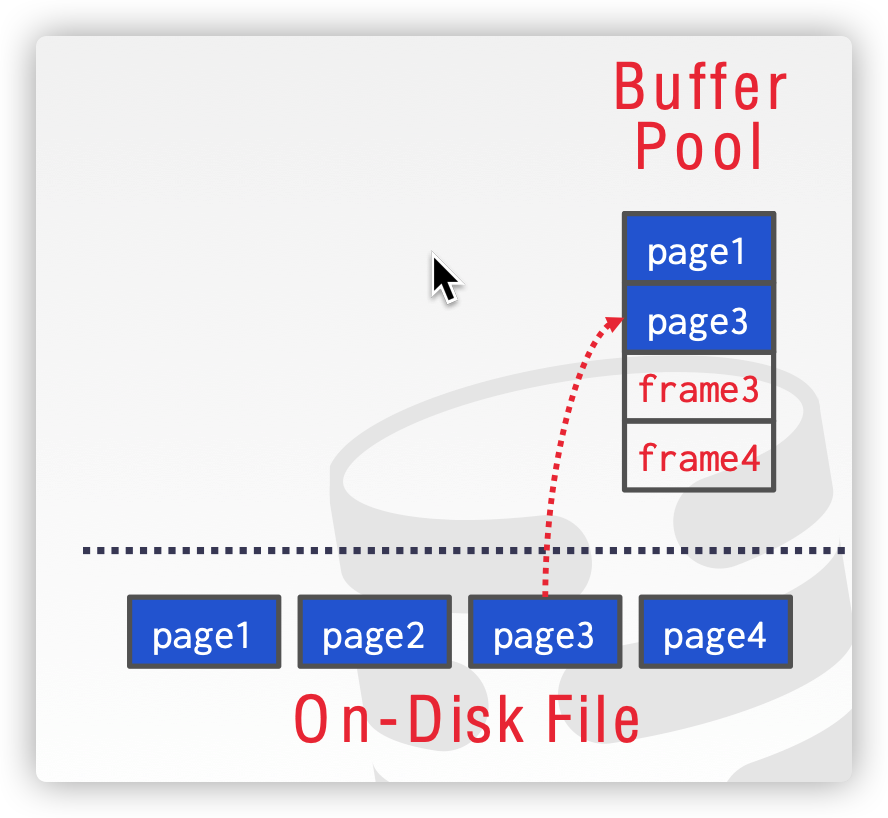
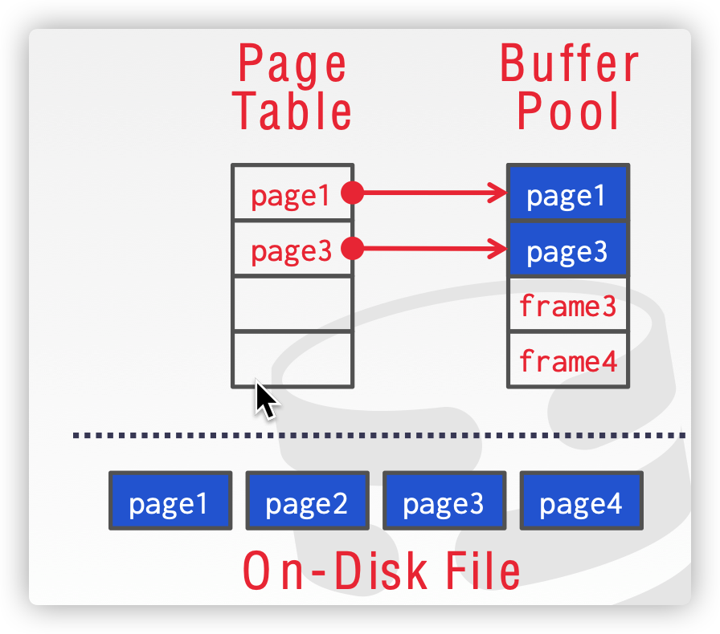
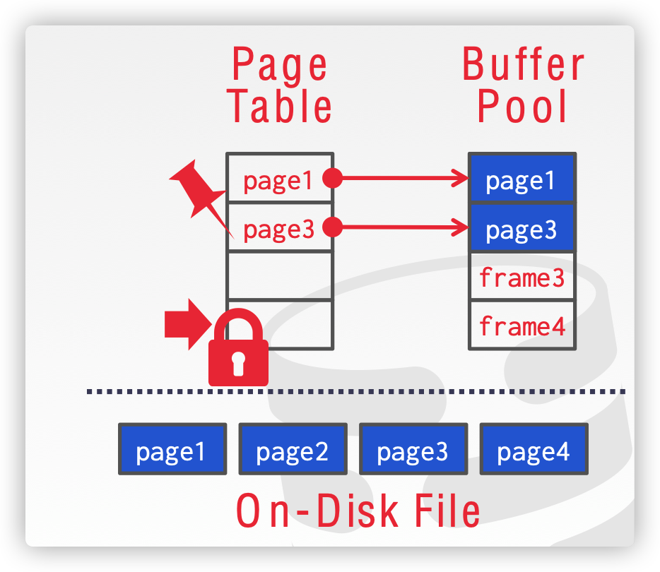
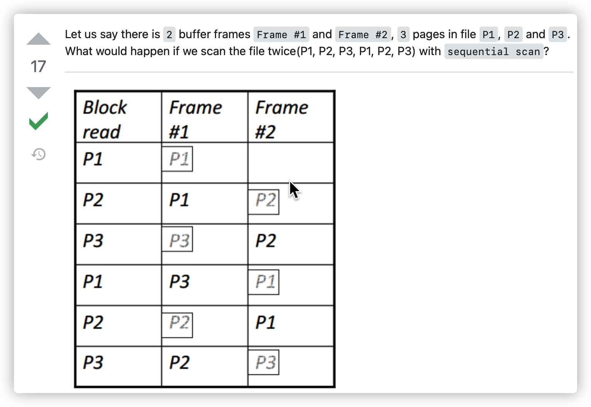

DBMS管理数据在内存与磁盘之间的移动分为两个方面：

- 空间控制：决定将页面写入磁盘的哪个位置，使得经常一起使用的页面距离近，从而提高I/O效率（空间局部性）
- 时间控制：决定何时将页面从磁盘读入内存、写回磁盘，使得读写的次数最小，从而提高I/O效率（时间局部性）

---

## 缓冲池管理器（Buffer Pool Manager）

DBMS 启动时向 OS 申请一片内存区域，即缓冲池（Buffer Pool），并且缓冲池划分成大小相同的页面，为了和磁盘上的页面（pages）区分，通常称为帧（frames），当 DBMS 请求一个磁盘上的页面（page）时，首先需要将其复制到缓冲池中的一个帧（frame）中。

同时 DBMS 会维护一个页表（page table），负责记录每个页面（page）在内存中的位置（frame），以及是否被修改过（dirty flag），是否被引用或引用计数（pin/reference counter）等元信息。

当页表（page table）中的某个页面（page）被引用时，会记录引用数（pin number），表示该页面正在被使用，即使缓冲池空间不足也不应该被驱逐（evicted）；

当被请求的页面（page）不在页表（page table）中时，DBMS 会先申请一个锁（latch），表示该条目已经被占用，然后从磁盘读取相关页面到缓冲池中，然后释放锁（latch）。

关于缓冲池（Buffer Pool）的改进：

- Multiple Buffer Pool：为了减少并发控制的开销以及利用数据的局部（locality），DBMS 可能在不同维度上维护**多个缓冲池**（Buffer Pool）。
- Prefetching：DBMS 可以通过查询计划来**预取**页面（pages）。
- Sacn Sharing：主要用于多个查询存在**数据共用**的情况。
- Buffer Pool Bypass：当遇到大数据量的顺序扫描（Sequential Scan）时，如果将所需页面（pages）顺序存入缓冲池（Buffer Pool），将造成**缓冲池污染**，因为这些页面通常只使用一次，而它们的进入将导致一些可能在未来更需要的页面被移除。因此一些 DBMS 做了相应的优化，在这种查询出现时，为它单独分配一块局部内存，将其对 Buffer Pool 的影响**隔离**。
- OS Page Cache：大部分磁盘读写操作都是通过系统调用（System Call）完成，通常系统会维护自身的数据缓存，这将导致一份数据分别在操作系统的 DBMS 中被**缓存两次**。因此大多数 DBMS 会使用（O_DIRECT）来告诉 OS 不要再缓存这些数据，这样一份数据就只被缓存一次，以提高效率。

---

## 缓冲池置换策略（Buffer Replacement Policies）

当缓冲池（Buffer Pool）空间不足时，读入新的页面（pages）必需需要 DBMS 从缓冲池（Buffer Pool）中已有的页面中选择一些驱逐（evict），该选择由缓冲池置换策略（Buffer Replacement Policies）完成，主要目标有：

- Correctness：操作过程中要保证**脏数据（dirty）同步到磁盘（disk）**
- Accuracy：尽量**选择不常用的页面移除**
- Speed：**决策要迅速**，每次移除 pages 都需要申请 latch，使用太久将使得并发度下降
- Meta-data overhead：决策所使用的**元信息占用的量不能太大**

### 最近最少未使用（Least Recently Used，LRU）

维护每个页面（page）上一次被访问的时间戳，每次移除具有最早时间戳的页面（page）。

### 时钟（Clock）

Clock 是 LRU 的近似策略，不需要每个页面（page）上次被访问的时间戳，而是为每个页面（page）保存一个引用位（reference bit）

- 每当页面（page）被访问时，引用位（reference bit）被设置为 1。
- 每当需要移除页面（page）时，从上次访问位置开始，按顺序轮训每个页面的引用位，若该位（bit）为 1，则重置为 0；若该位（bit）为 0，则将该页面（page）移除。

---

LRU 和 Clock 具有的问题

上述两种置换算法都容易受 sequential flooding 现象影响，从而导致最近被访问的页面（page）实际上却是最不可能需要的页面。

关于缓冲池置换策略（Buffer Replacement Policies）的一些改进：

- LRU-K：保存每个页面的最后 K 次访问时间戳，利用这些时间戳来估计它们下次被访问的时间。
- Localization：DBMS 针对每个查询做出移除 pages 的限制，使得这种影响被控制在较小的范围内。
- Priority Hints：有时候 DBMS 知道每个 page 在查询执行过程中的上下文信息，因此它可以根据这些信息判断一个 page 是否重要。
- **Dirty Pages**：移除一个 dirty page 的成本要高于移除一般 page，因为前者需要写 disk，后者可以直接 drop，因此 DBMS 在移除 page 的时候也需要考虑到这部分的影响。除了直接在 Replacement Policies 中考虑，有的 DBMS 使用 Background Writing 的方式来处理。它们定期扫描 page table，发现 dirty page 就写入 disk，在 Replacement 发生时就无需考虑脏数据带来的问题。

