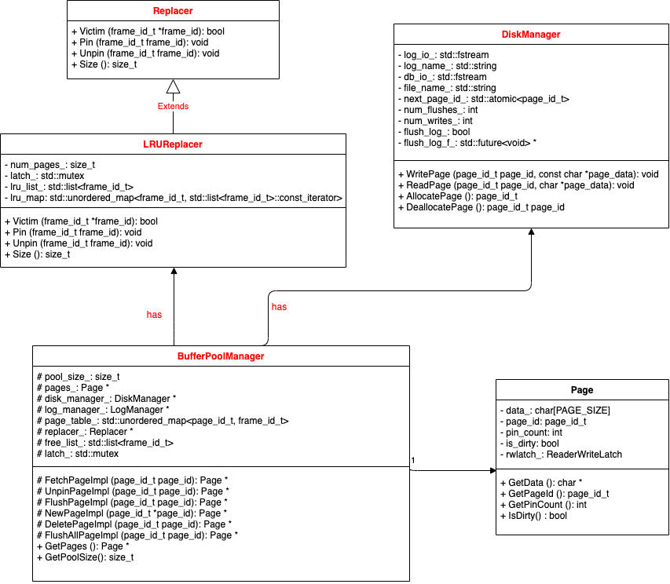

# 总类图

# LRU Replacer
## 成员变量
std::mutex latch;//线程锁

size_t max_num_pages;//LRU最大容量

std::list<frame_id_t> LRUlist;//用于判断替换顺序的链表

std::unordered_map<frame_id_t,std::list<frame_id_t>::iterator> LRUmap;//用于快速查找

## 成员函数
### bool Victim(frame_id_t *frame_id)
当replacer没有跟踪任何页框号时, 无法牺牲任何一页,返回false, 否则应将*frame_id指向的值设置为应被牺牲的页框号,即链表中尾元素，并在replacer的数据结构中消除该页号,并返回 True；

### void Pin(frame_id_t frame_id)
当replacer没有跟踪需要被固定的页框号时不做任何事, 否则应在replacer中消除该页号；
### void Unpin(frame_id_t frame_id)
当replacer已跟踪需要被取消固定的页框号时不做任何事, 否则应在replacer中添加该页框号并设置该页框号的使用情况设置为"最近"，即加入到链表的头部。

# Buffer Pool Manager
## 成员变量
size_t pool_size_;  //Number of pages in the buffer pool. 

Page *pages_; //Array of buffer pool pages. 

DiskManager *disk_manager_ __attribute__((__unused__));//Pointer to the disk manager. 

LogManager *log_manager_ __attribute__((__unused__));//Pointer to the log manager. 

std::unordered_map<page_id_t, frame_id_t> page_table_;//Page table for keeping track of buffer pool pages. 

Replacer *replacer_;// Replacer to find unpinned pages for replacement. 

std::list<frame_id_t> free_list_;// List of free pages. 

std::mutex latch_;// This latch protects shared data structures. We recommend updating this comment to describe what it protects. 

## 成员函数
### Page *FetchPageImpl(page_id_t page_id)
1. 若该页在页表中存在, 直接使用并pin它

2. 若该页在页表中不存在:

	(1)若free_list中仍有空闲帧, 从磁盘中复制它到空闲帧；若free_list没有空闲帧, 检查LRU中是否有跟踪的unpin帧

	​	1)如果没有, 说明此时不能牺牲任何一页
	​	
	​	2)如果有页, 用LRUreplacer决定牺牲的页框号, 并以新代旧, 在替换前: 若旧页被写过(dirty), 调用disk_manager_->WritePage()先将旧页的最新内容写回磁盘

	(2)维护新页在pages_中该页框的metadata, 即 pin_count、page_id、is_dirty

	(3)调用disk_manager_->ReadPage()将磁盘中该页的内容写到该页框中
### bool UnpinPageImpl(page_id_t page_id, bool is_dirty)
1. 将该页的pin_count_减1，如果该页为脏页，则设置页面的脏位设置为true；

2. 如果页面的引用计数为 0，则调用置换器的 Unpin() 函数，将该页面加入置换器。

### bool BufferPoolManager::FlushPageImpl(page_id_t page_id)
1. 如果该页面为脏，调用disk_manager_->WritePage(), 将其新内容写回磁盘

2. 在缓冲池中将该页脏页标志置为false
### Page *BufferPoolManager::NewPageImpl(page_id_t *page_id)
1. 调用disk_manager_->AllocatePage()获取一个新的页号；
2. 若缓冲池已满且所有页均标记为pin, 说明此时不能牺牲任何一页
3. 若缓冲池未满, 则使用掉一个空闲的页框
4. 若有unpin的页, 使用LRUreplacer决定牺牲的页框号, 并检查其是否为脏页, 是则写回磁盘, 在页表中清除旧页id
5. 将新页号加载到该页框, 即
* 清空该页内容
* 线程计数置为1
* 脏页标志置为false
* page_id设为新页号，并加入到页表中
### bool BufferPoolManager::DeletePageImpl(page_id_t page_id)

1. 调用disk_manager_->DeallocatePage()释放磁盘上该页面的内容；
2. 当该页pin_count_不为0, 表示仍有线程使用该页, 不能删除；
3. 否则，从页表和LRUreplacer中删除该页所在页框号；
4. 在空闲链表中加入该页所在页框号；
5. 设置该帧的page_id为INVALID_PAGE_ID，脏位为false；

### FlushAllPagesImpl

对于缓冲池中的每一页:

* 调用disk_manager_->WritePage()写回磁盘

* 脏页标记置为false

