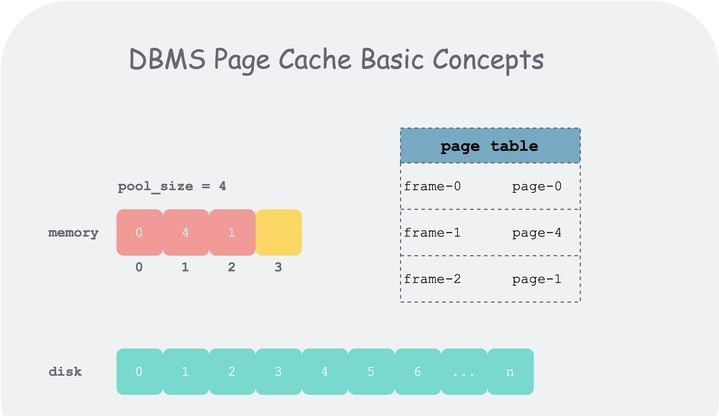

# LRU Replacer
LRU替换策略，是一种常用的页面置换算法，把最近最久未使用的page给置换出去。其核心思想是“如果数据最近被访问过，那么将来被访问的几率也更高”，即如果一个数据在最近一段时间没有被访问到，那么在将来它被访问的可能性也很小。也就是说，当限定的空间已存满数据时，应当把最久没有被访问到的数据淘汰。

一般来说，LRU策略的实现有：
1. 用一个数组来存储数据，给每一个数据项标记一个访问时间戳，每次插入新数据项的时候，先把数组中存在的数据项的时间戳自增，并将新数据项的时间戳置为0并插入到数组中。每次访问数组中的数据项的时候，将被访问的数据项的时间戳置为0。当数组空间已满时，将时间戳最大的数据项淘汰。

2. 利用一个双向链表来实现，每次新插入数据的时候将新数据插到链表的头部；每次缓存命中（即数据被访问），则将数据移到链表头部；那么当链表满的时候，就将链表尾部的数据丢弃。
	
3. 利用双向链表和hashmap。当需要插入新的数据项的时候，如果新数据项在链表中存在（一般称为命中，通过hashmap查找），则把该节点移到链表头部，如果不存在，则新建一个节点，放到链表头部，若缓存满了，则把链表最后一个节点删除即可。在访问数据的时候，如果数据项在链表中存在，则把该节点移到链表头部，否则返回-1。这样一来在链表尾部的节点就是最近最久未访问的数据项。

本实验就是采用第3种方式实现的。 

在本实验中，LRUreplacer ，维护一个 unpinned 的 frame_id 列表 ，在调用 Unpin 时将 frame_id 加入列表并维护新老顺序、在调用 Pin 时将 frame_id 从列表中摘除、在调用 Victim 的时候将最老的 frame_id 返回。

# Buffer Pool Manager
## 核心概念
buffer pool 的操作的基本单位为一段逻辑连续的字节数组，在磁盘上表现为页（page），有唯一的标识 page_id；在内存中表现为帧（frame），有唯一的标识 frame_id。为了记下哪些 frame 存的哪些 page，需要使用一个页表（page table）。

page 和 frame这两个概念都是 buffer pool 管理数据的基本单位，一般为 4k，其区别如下：

1. page_id是这一段单位数据的全局标识，而 frame_id只是在内存池（frame 数组）中索引某个frame的下标；

2. 通俗来讲，就是，page是磁盘中，真是存在的内容，有数据和各种元信息，而frame，是内存中，用于装载page的容器，几个连续的frame即frame数组就组成了一个缓冲池，buffer pool。

而管理帧的缓冲池大小一般来说是远于磁盘的，因此在缓冲池满了后，再从磁盘加载新的页到缓冲池中，需要某种替换策略（replacer）将一些不再使用的页踢出缓冲池以腾出空间。本实验采用的替换策略就是上述的LRU替换策略。

各概念如图所示：
	

## 核心数据流
buffer pool 维护了一个 frame 数组，每个 frame 有三种状态：
	1. free：初始状态，没有存放任何 page
	2. pinned：存放了 thread 正在使用的 page
	3. unpinned：存放了 page，但 page 已经不再为任何 thread 所使用

这三种状态，有三种数据结构来区别：
	1. 页表：page table，存放page_id与frame_id映射对，被页表保存的frame都存放了page，即状态为pin和unpin的frame；
	2. 空闲列表：free_list，存放没有page内容的frame，即状态为free的frame；
	3. LRUReplacer：存放了状态为unpin的frame。
	即：
	1. free状态的frame：在free_list中；
	2. unpinned状态的frame：在LRU中；
	3. unpinned和pinned状态的frame：在页表中；
	4. pinned状态的frame：在页表中，但不在LRU中。

而待实现函数：
```cpp
FetchPageImpl(page_id)
NewPageImpl(page_id)
UnpinPageImpl(page_id, is_dirty)
DeletePageImpl(page_id)
```
便是驱动状态机中上述状态发生改变的动作（action），状态机如下：
	

对应到实现时数据结构上：
	1. 保存 page 数据的 frame 数组为 pages_;
	2. 所有 free frame 的索引（frame_id）保存在 free_list_ 中
	3. 所有 unpinned frame 的索引保存在 replacer_ 中
	4. 所有 pinned frame 索引和 unpinned frame 的索引保存在 page_table_ 中，并通过 page 中 pin_count_ 字段来区分两个状态。

上图中，NewPage1 和 NewPage2 表示在 NewPage 函数中，每次获取空闲 frame 时，会先去空闲列表（freelist_）中取一个 free frame，如果取不到，才会去 replacer_ 中驱逐一个 unpinned 的 frame 后使用。这体现了 buffer pool manager 实现的一个目标：最小化磁盘访问。

放到更大的语境中，本质上，replacer 就是一个维护了回收顺序的回收站，即我们将所有 pin_count_ = 0 的 page 不直接从内存中删除，而是放入回收站中。根据数据访问的时间局部性原理，刚刚被访问的 page 很可能再次被访问，因此当我们不得不从回收站中真删（Victim）一个 frame 时，需要删最老的 frame。当之后我们想访问一个刚加入回收站的数据时， 只需要将 page 从这个回收站中捞出来，从而省去一次磁盘访问，这也就达到了最小化磁盘访问的目标。
