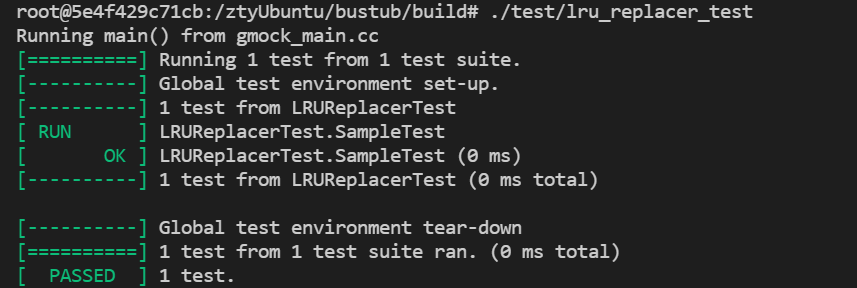
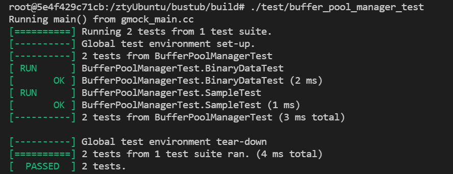
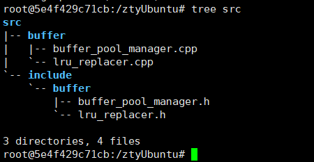
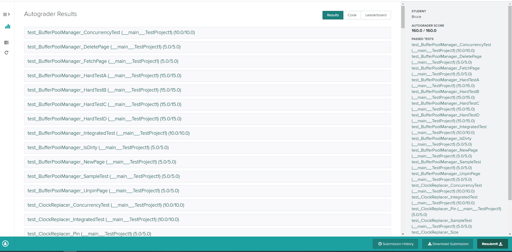
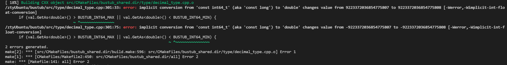

# 环境搭建及测试流程
## 一、搭建本地运行环境
* 将CMU的bustub仓库fork到自己的仓库
* 在服务器上设置网络代理以访问谷歌和github：
	1. 修改配置文件：`vim $HOME/.profile`
	2. 将下面内容添加到这个文件后面
	```bash
	export http_proxy=socks5://192.168.2.164:10809
	export https_proxy=socks5://192.168.2.164:10809
	```
	3. 更新网络代理设置：`source $HOME/.profile`

* 将仓库克隆到本地服务器：
	`git clone https://github.com/ztygreat/bustub.git`
* 进入项目目录：cd bustub
* 开始做项目

## 二、本地测试
* 当前工作目录：/...../bustub/
* `build_support/packages.sh`
* `mkdir build`
* `cd build`
* `cmake ..`
* `make lru_replacer_test`
* ./test/lru_replacer_test --gtest_also_run_disabled_tests（或者进入test文件将TEST函数中DISABLED_前缀去掉）
	测试结果截图：
	
* make buffer_pool_manager_test
* ./test/buffer_pool_manager_test --gtest_also_run_disabled_tests（或者进入test文件将TEST函数中DISABLED_前缀去掉）
	测试结果截图：
	
	
## 三、官网测试
* 注册时需要使用CMU15-445提供的课程码；
* 在提交测试代码时，需要将4个文件包含在一个zip压缩包内，文件的位置也有要求，如图：
	

* 测试结果截图：
	

## 遇到的问题
* 在本地测试中，进行`cmake ..`时，发生错误：网上解释为gcc编译器版本问题
	```cpp
	/ztyUbuntu/bustub/src/type/decimal_type.cpp:301:33: 
	
	error: implicit conversion from 'const int64_t' (aka 'const long') to 'double' changes value from 9223372036854775807 to 9223372036854775808 [-Werror,-Wimplicit-int-float-conversion]
	
	if (val.GetAs<double>() > BUSTUB_INT64_MAX || val.GetAs<double>() < BUSTUB_INT64_MIN) {
	```
	详情截图如下：
	
	解决方法：加上显式转换
	
	```cpp
	if (val.GetAs<double>() > static_cast<double>(BUSTUB_INT64_MAX) || val.GetAs<double>() < static_cast<double>(BUSTUB_INT64_MIN)) {
	```

* 在官网测试中，官网只会给出分数，她所提供的bug仅供参考，如果有错，需要对每一个函数进行的debug