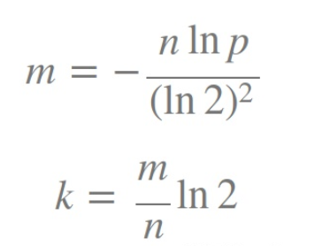
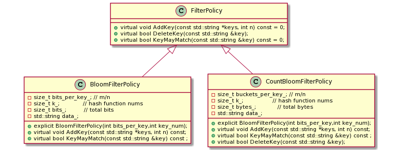
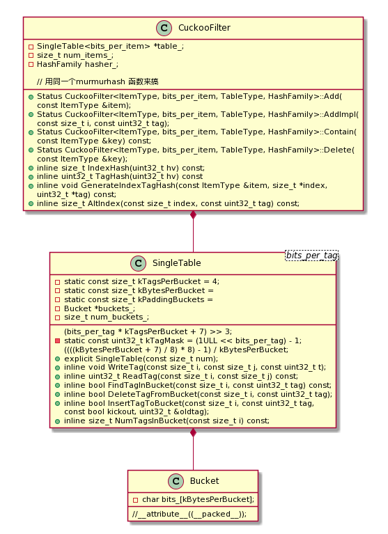

## 一、BloomFilter
> In fact the code throuth this project of me is not correctly tested and not reliable. 
### 1.1 BloomFilter 重要公式



```c++
// m/n = bits_per_key ~ false positive rate
explicit BloomFilterPolicy(int bits_per_key,int key_num){
    k_ = static_cast<size_t>(bits_per_key * 0.69);
    bits_ = key_num * bits_per_key;
	......
}
```

### 1.2 哈希函数选择

哈希算法广泛应用于很多场景，例如安全加密和数据结构中哈希表的查找，布隆过滤器和负载均衡（一致性哈希）等等。 

* Hash函数分类

  ```
  加密哈希              
  应用于(1) 文件校验 (2) 数字签名        
  常见的有： MD5,SHA-1,SHA-2,DSA-SHA1,RSA-SHA1  
  加密哈希函数应该对抗碰撞性和抗篡改性要求很高，而会牺牲查找效率。
  ```

  ```
  非加密哈希（查找哈希函数） 
  应用于：哈希表的查找，过滤器，一致性哈希
  常见的有：MurmurHash,lookup3,FNV,SpookyHash 
  查找哈希函数更追求查找的效率和良好的抗碰撞性。
  ```

* **MurmurHash** 是一种非加密型哈希函数，适用于一般的哈希检索操作。与其它流行的哈希函数相比，对于规律性较强的key，MurmurHash的随机分布特征表现更良好。选择了这个应用比较广泛，实现比较简单的hash函数，redis,leveldb都在使用这个思想的hash函数。
* **FALLTHROUGH_INTENDED**增加代码可读性。

```c++
#ifndef FALLTHROUGH_INTENDED
#define FALLTHROUGH_INTENDED do { } while (0)
#endif
uint32_t Hash(const char *data, size_t n, uint32_t seed) {
    // Similar to murmur hash
    const uint32_t m = 0xc6a4a793;
    const uint32_t r = 24;
    const char *limit = data + n;
    uint32_t h = seed ^(n * m);

    // Pick up four bytes at a time
    while (data + 4 <= limit) {
        // 取出4字节
        // little endian only
        uint32_t w = *reinterpret_cast<const uint32_t * >(data);
        data += 4;
        h += w;
        h *= m;
        h ^= (h >> 16);
    }
    // Pick up remaining bytes
    switch (limit - data) {
        case 3:
            h += static_cast<unsigned char>(data[2]) << 16;
            FALLTHROUGH_INTENDED;// 人为FALLTHROUGH
        case 2:
            h += static_cast<unsigned char>(data[1]) << 8;
            FALLTHROUGH_INTENDED;// 人为FALLTHROUGH
        case 1:
            h += static_cast<unsigned char>(data[0]);
            h *= m;
            h ^= (h >> r);
            break;
    }
    return h;
}
```

### 1.3 Double Hash

```c++
     // Use double-hashing to generate a sequence of hash values.
     // See analysis in [Kirsch,Mitzenmacher 2006].    
	 //Gi(x)=H1(x)+iH2(x)
     //H2(x)=(H1(x)>>17) | (H1(x)<<15) 
	 uint32_t h = BloomHash(keys[i]);
     const uint32_t delta = (h >> 17) | (h << 15);  // Rotate right 17 bits 循环右移17位
     for (size_t j = 0; j < k_; j++) {
         //计算并更新对应的bit为1
         const uint32_t bitpos = h % bits_;
         array[bitpos / 8] |= (1 << (bitpos % 8));
         h += delta;
     }
```

### 1.4 UML Class Diagram



## 二、 Cuckoo Filter


其中 ⊕ 是异或运算
也就是说， 知道了当前的loc1即h1(x)， 知道指纹信息tag， 就可以计算出另外一个loc2即h2(x)。

### 2.1 hasher_ =  murmurhash

```c++
        inline size_t IndexHash(uint32_t hv) const {
            // table_->num_buckets is always a power of two, so modulo can be replaced
            // with
            // bitwise-and:
            return hv & (table_->NumBuckets() - 1);
        }

        inline uint32_t TagHash(uint32_t hv) const {
            uint32_t tag;
            // modulo op
            tag = hv & ((1ULL << bits_per_item) - 1);
            // tag+1 iff tag=0
            tag += (tag == 0);
            return tag;
        }

        inline void GenerateIndexTagHash(const ItemType &item, size_t *index,
                                         uint32_t *tag) const {
            const uint64_t hash = hasher_(item);
            *index = IndexHash(hash >> 32);
            *tag = TagHash(hash);
        }

        inline size_t AltIndex(const size_t index, const uint32_t tag) const {
            return ((uint32_t) (index ^ (tag )));
        }
```

### 2.2 UML Class Diagram 



## 三、[Bit Twiddling Hacks网站分享](http://www-graphics.stanford.edu/~seander/bithacks.html#IntegerMinOrMax) 

#### 3.1 Round up to the next highest power of 2

核心思想：最高位的1

```c++
// 方法1 先找到这个数中最大的位为1的位置，再左移1位。
/**
 * linux内核函数
 * ffs - find last (most-significant) bit set
 * @x: the word to search
 *
 * This is defined the same way as ffs.
 * Note fls(0) = 0, fls(1) = 1, fls(0x80000000) = 32.
*/
// int 32bit
static inline int __ffs(int x)
{
	int r = 0;

	if (!x)
		return 0;
	if (!(x & 0xffff)) {
		x >>= 16;
		r += 16;
	}
	if (!(x & 0xff)) {
		x >>= 8;
		r += 8;
	}
	if (!(x & 0xf)) {
		x >>= 4;
		r += 4;
	}
	if (!(x & 3)) {
		x >>= 2;
		r += 2;
	}
	if (!(x & 1)) {
		x >>= 1;
		r += 1;
	}
	return r;
}
```

```c++
// 方法2 http://www-graphics.stanford.edu/~seander/bithacks.html#IntegerMinOrMax
// unsigned int 32bit 
unsigned int upper_power_of_two(unsigned int v)
{
    v--;
    v |= v >> 1;
    v |= v >> 2;
    v |= v >> 4;
    v |= v >> 8;
    v |= v >> 16;
    v++;
    return v;
}
```

```
     0100 0001 8bit举例 -1是为了统一刚好等于2的指数倍的值 和 不等于2的指数倍的值 的操作
 -1= 0100 0000
|>>1 0010 0000
   = 0110 0000
|>>2 0001 1000
   = 0111 1000
|>>4 0011 0111
   = 0111 1111
 +1= 1000 0000
 注意1）：当v等于0的时候v--是最大负数，全为1，返回的v也是0，需要自己排除了
 注意2）：当传入第一位为1的数，会溢出，return 0
```

## 遇到的困难

#### count bloom filter 4bit操作

```c++
//  
struct Bucket {
    char bits_[1]; // 2个4bit
  } __attribute__((__packed__));
// 
buckets_ = new Bucket[num_buckets_]
    
// read tag from pos(i,j)
inline uint32_t ReadTag4Bit(const size_t i, const size_t j) const {
	// 第几个桶开始
	const char *p = buckets_[i].bits_;
	uint32_t tag;
	//   01    00
	//  0000  0000
	// (j&1) << 的哪一部分。
	tag = *((uint8_t *) p) >> ((j & 1) << 2);
	return tag & kTagMask;
}

inline void WriteTag4Bit(const size_t i, const size_t j, const uint32_t t){
	char *p = buckets_[i].bits_;
	uint32_t tag = t & kTagMask;
	if ((j & 1) == 0) {
	// 先置0再置1 低4位
	*((uint8_t *) p) &= 0xf0;
	*((uint8_t *) p) |= tag;
	} else {
	// 先置0再置1 高4位
	*((uint8_t *) p) &= 0x0f;
	*((uint8_t *) p) |= (tag << 4);
	}
}
```

#### 过滤器扩容


### 参考文献

[Bit Twiddling Hacks](http://www-graphics.stanford.edu/~seander/bithacks.html#IntegerMinOrMax)

[double-hash](https://www.eecs.harvard.edu/~michaelm/postscripts/esa2006a.pdf)

[leveldb-bloom.cc](https://github.com/google/leveldb/blob/master/util/bloom.cc)

