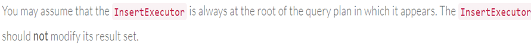

# 项目问题

1.**insert、update 和 delete在官网中有一个类似的描述：**

不更新结果集的意思是：insert、update 和 delete不应该向外输出任何元组，所以其总是返回false，即所有的插入操作均应当在一次Next中被执行完成。

2.**删除的时候只需要调用MarkDelete()标记就行，真正的删除在事务提交的阶段。但是在删除之后就删除了索引，索引删除执行不需要到事务提交阶段吗？**

逻辑上讲，索引删除也是在事务提交阶段执行的。

3.**官方文档中要求seq_scan_executor中要调AbstractExpression类中的Evaluate来过滤查询结果。**

**只有查询（select）的时候才会调Evaluate，插入更新删除不会。**

**这里的Evaluate是不是就是查询优化过程中的估计器？**

并非。这里的Evaluate仅仅与本项目有关，与查询执行过程中的估计器无关。

4.**查询计划在Bustub中被定义为了文件abstract_plan.h 中的一个抽象类AbstractPlanNode，它会被不同的SQL操作对应的查询计划继承，衍生出了如seq_scan_plan、insert_plan之类的一系列具体的查询计划类。**

**每一个操作的头文件中都会有一个这个变量，会在实现中调用其拥有的方法。**

**查询操作有查询计划，插入操作有插入计划等等。这里的计划实质上是指什么？**

整体上，数据库的查询计划是位于查询执行阶段前的，作为查询执行的输入，这里的查询计划仅与本项目有关，属于简化的查询计划。

5.**所有executor是如何进行谓词判断的？**

所有的表达式都基于一个抽象类 abstract_expression.h，通过查看测试文件可以知道所有谓词都被初始化为一个比较表达式 comparison_expression.h，谓词的判断通过调用该类中的Evaluate()方法实现。