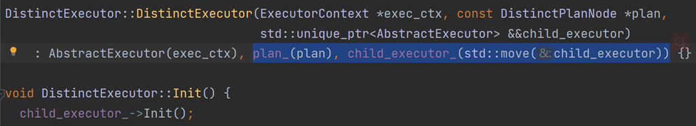

# 项目问题

1. **hash_join，aggregation和distinct中的哈希表的作用分别是什么？**

   hash_join中的哈希表：将元组的连接键作为哈希表的键，并使用其中一个子计划节点的元组构造哈希表。这样另一个子计划节点中的元组仅需在该元组映射的桶中寻找可与其连接的元组。

   aggregation中的哈希表：AggregateKey中存放的是group by的列的不同组合，AggregateValue中存放的是各种聚合函数的结果。经过这样处理后，按照group by分出来的各个组都存有一个自己的聚合函数结果。

   distinct中的哈希表：使用哈希表方法去重。判断当前元组是否已经出现在哈希表中，如是则遍历下一个输入元组，如非则将该元组插入哈希表并返回。

2. **内存安全问题**

   

   构造函数中记得初始化相关变量，否则会有内存安全问题。

3. **Hash Join的多表连接情况与两表连接有何区别**

   表的连接，其本质上都是依次连接，下一个表与前几个表的结果再进行连接。例如Hash Join的三表以上情况，把两个表的Hash Join后的集合，再与第三个表进行Hash Join扫描。

4. **distinct_executor如何去重？**

   使用哈希表去重，哈希表的哈希函数设计参照SimpleAggregationHashTable，只不过aggregation_executor的Key构造只用到group by的属性，而distinct_executor的Key构造需要用到元组的所有属性

   